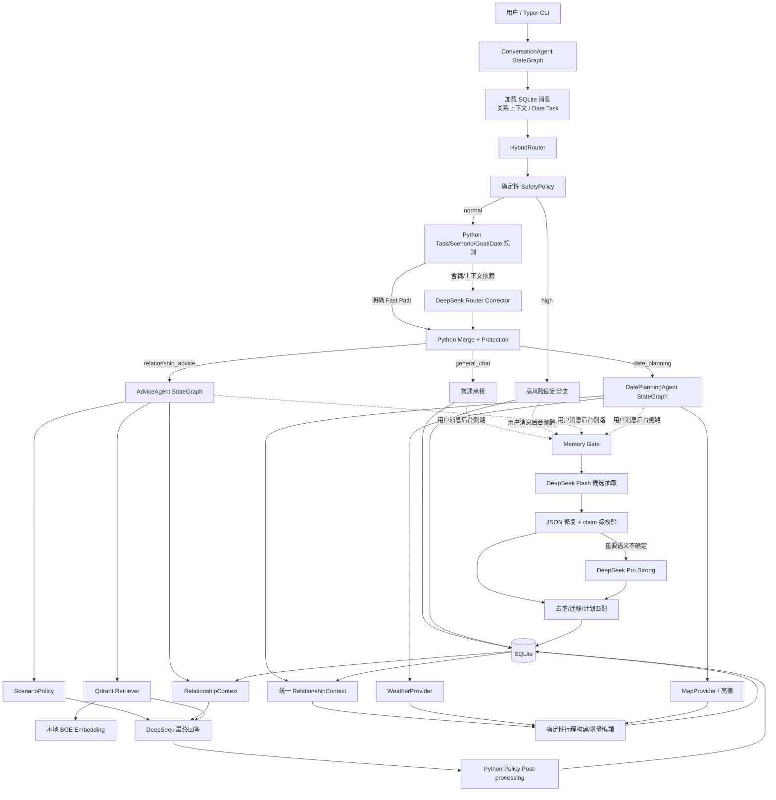
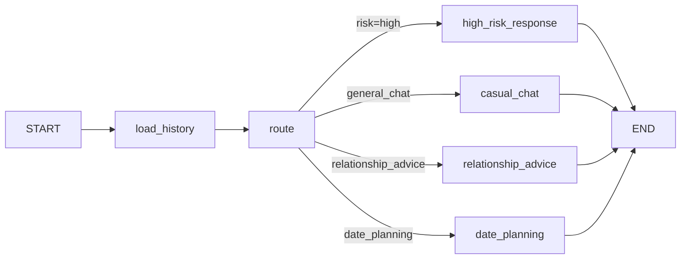
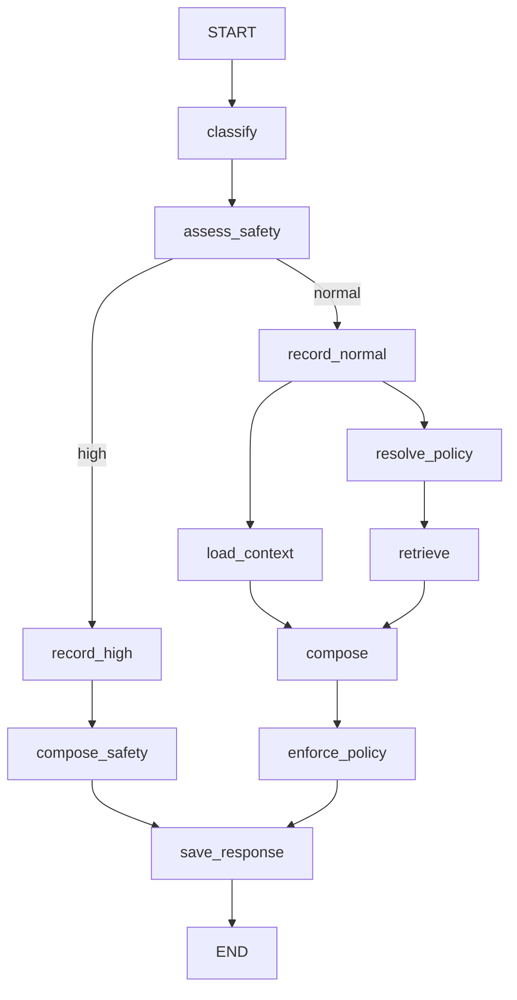
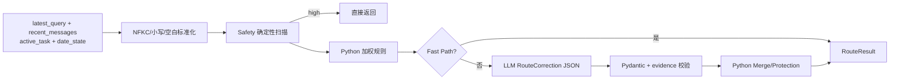
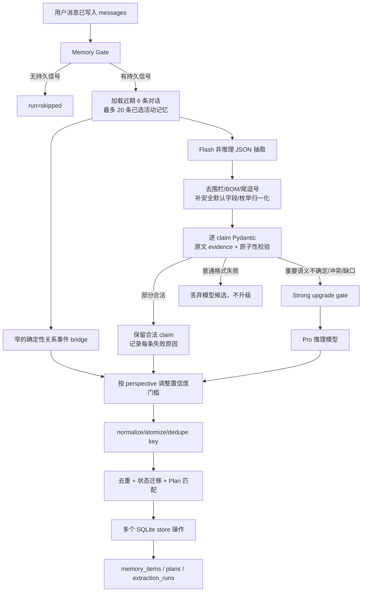
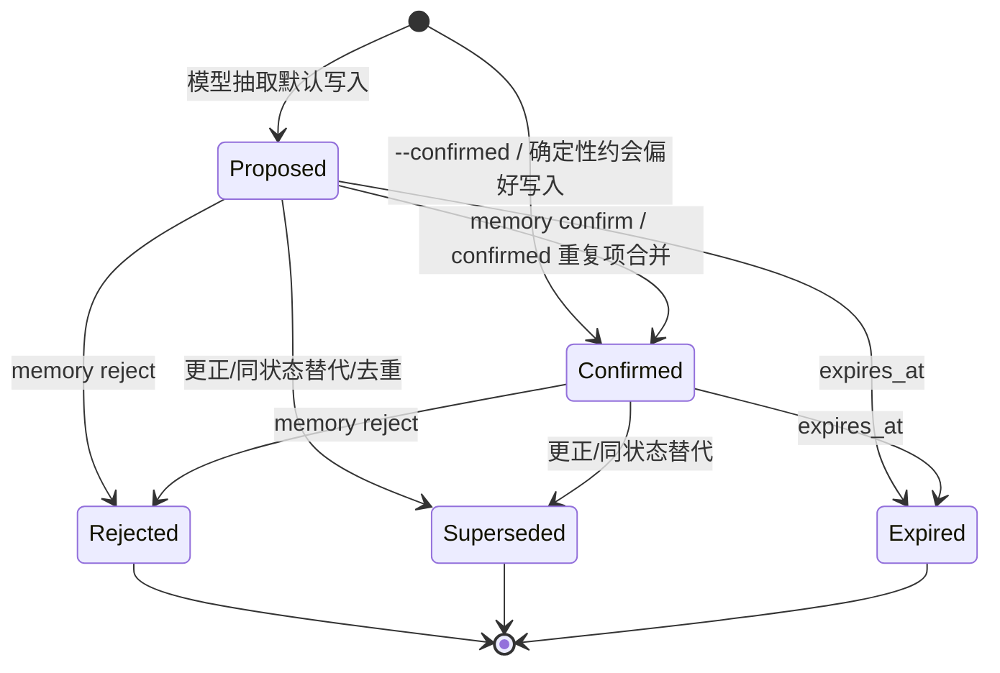
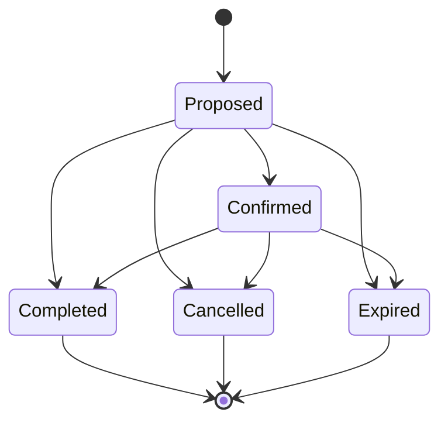
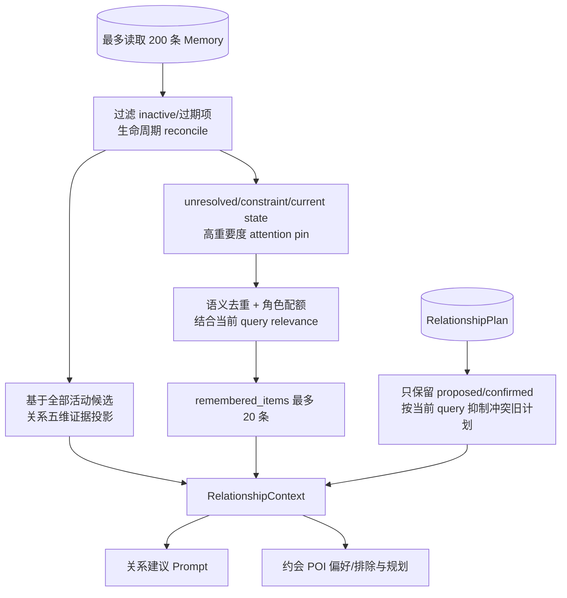

# LoveApp 面试项目说明

> 目标岗位：Python Agent 开发、LLM 应用开发、LangGraph、RAG、Memory、工具集成与后端工程。  
> 事实基线：2026-08-03 仓库审计。本文以当前源码为准，`docs/LoveApp_Project_Audit.md`、测试、SQLite 快照、评测集和历史 baseline 作为交叉证据。  
> 状态标记：`[已实现]` 表示当前有可执行代码和调用路径；`[部分实现]` 表示主路径存在但覆盖、评测或产品化不完整；`[设计中]` 表示尚无可执行实现；`[尚未验证]` 表示缺少当前环境、日志或有效评测证据。

## 0. 面试事实红线

1. “有实现”不等于“已在生产验证”。当前是本地 CLI 原型，没有线上 SLA、真实用户效果或成本数据。
2. 当前使用 LangGraph，但没有使用 LangChain、LangGraph checkpointer 或模型原生 function calling。
3. SQLite 是跨轮事实源；LangGraph `State` 只是一轮 `ainvoke` 的运行态。
4. `messages`、关系级持久化 Memory、读取时状态投影和 `DatePlanningTaskState` 是四种不同数据，不要统称为“长期记忆”。
5. 配置中的 20/30/60/120 秒是 OpenAI-compatible 客户端的单请求 timeout，不是整轮 Graph 的硬 deadline；SDK 重试、Router 结构修正请求和 Flash -> Strong 串联都可能使总耗时更长。
6. “Tool Calling”在当前项目中指 Python 节点调用类型化地图/天气适配器，不是 LLM 自主选工具。
7. Router、RAG、Safety 和 Gate 的 1.0 指标都来自固定小集合；Router corrector 还是测试替身，不能外推为真实模型或线上准确率。
8. `NO_MIND_READING`、关系证据投影和 Memory lifecycle 都是可解释的规则实现，不是经过统计校准的真值判断器或形式化安全证明。
9. Router correction 的 `evidence_spans` 只做响应级原文校验，没有和每个 Date Slot 建立字段级 provenance；不能说 LLM Slot 一定来自用户原话。
10. `memory_context_limit=20` 只限制选中的原始 Memory items；五维聚合证据和 active plans 另行进入 Context，当前没有整个 Prompt 的对象数或 token 硬上限。

证据总览：`docs/LoveApp_Project_Audit.md:17-34`、`docs/LoveApp_Project_Audit.md:125-161`、`docs/LoveApp_Project_Audit.md:631-669`；Slot grounding 直接证据为 `src/loveapp/adapters/routing/openai_compatible.py:133-139`、`src/loveapp/application/routing.py:2149-2180`；Context 上限直接证据为 `src/loveapp/application/memory.py:896-981`、`src/loveapp/adapters/advice/openai_compatible.py:207-250`。

> 审计文档 `docs/LoveApp_Project_Audit.md:518-520` 对“Slot 只合并原文明确字段”和 `locked_item_ids` 的表述偏乐观。本文已按当前源码纠正：前者只有响应级 evidence，后者只有 schema 字段。面试时不要单独引用那两行审计结论。

## 1. 项目一句话介绍

### 20 字以内版本

> 面向关系咨询的有状态 Agent

### 简历中的一句话版本

> 设计并实现 LoveApp：一个以 LangGraph 编排的关系咨询与约会规划有状态 Agent，包含混合路由、RAG、关系级持久化记忆、约会任务状态、地图适配器、安全策略和阶段 Trace。

### 面试开场版本

> LoveApp 不是把恋爱问题直接转发给大模型的聊天机器人，而是一个面向关系咨询场景的有状态 Agent。它先做确定性安全扫描和混合路由，再根据任务进入关系建议或约会规划工作流；关系建议会结合 RAG 和跨会话记忆，约会规划会持续收集参数并调用地图工具。这个项目最值得讲的不是 UI，而是我如何处理路由误触发、持久化 Memory 的污染与更新、多轮任务状态、工具失败和模型延迟。

上述定位与当前三类一级任务、三张 LangGraph 及 CLI 入口一致。证据：`src/loveapp/domain/enums.py:34-37`、`src/loveapp/agents/conversation.py:37-132`、`src/loveapp/cli.py:61-66`。

## 2. 项目背景与问题定义

### 2.1 用户实际问题

[已实现] 当前系统处理三类一级任务：

1. 普通对话：问候、感谢、简短承接。
2. 关系建议：追求、冲突、聊天分析、关系维护、边界和分手。
3. 约会规划：从模糊意图到地点搜索、单日/多日行程和已有计划修改。

Risk 不被建模为第四个业务任务，而是覆盖业务路由的独立安全维度。证据：`src/loveapp/domain/enums.py:4-10`、`src/loveapp/domain/enums.py:24-37`、`src/loveapp/domain/enums.py:91-94`、`src/loveapp/application/routing.py:41-57`。

典型输入不是互相独立的单轮问题。例如：

- “她最近回复少了，我该不该继续主动？”同时包含事实、用户目标和关系阶段判断。
- “我想约她吃饭，你看怎么样？”是在咨询做法，不等于要求系统立刻生成行程。
- “上海静安区，下周六，预算一千，晚饭西餐”可能只是上一轮约会任务的 slot 补充。
- “上次爬山回来后，她还关心我的伤”既是已发生事件，也可能关闭此前的未来计划。
- “不知道她是不是单身”不会立即得到答案，但会影响之后一段时间的建议。

### 2.2 为什么普通 ChatBot 不够

[已实现] 单轮 ChatBot 缺少以下能力：

- **任务语义**：需要区分“评价约会想法”和“执行约会规划”，关键词“约、吃饭、电影”本身不足以决定路由。`DateRequestMode` 明确区分 `evaluate`、`place_search`、`itinerary`、`modify` 等语义。证据：`src/loveapp/domain/enums.py:40-45`、`src/loveapp/application/routing.py:1185-1208`。
- **跨轮任务状态**：城市、日期、预算和替换要求常分多轮给出，必须合并而不是每轮重开任务。证据：`src/loveapp/domain/date_task.py:18-75`、`src/loveapp/adapters/date_tasks.py:60-116`。
- **跨会话关系状态**：用户偏好、对方偏好、互动趋势、当前冲突、待确认问题和未来计划不能只依赖短对话窗口。证据：`src/loveapp/domain/memory.py:15-74`、`src/loveapp/domain/memory_context.py:108-217`。
- **知识约束**：关系建议需要可检索的领域问答，而不是完全依赖模型参数记忆。证据：`src/loveapp/domain/knowledge.py:12-50`、`src/loveapp/agents/advice.py:225-245`。
- **外部现实信息**：具体餐厅、博物馆、路线无法靠语言模型可靠生成，必须调用地图服务。证据：`src/loveapp/adapters/maps/amap.py:46-153`。
- **确定性安全边界**：暴力、跟踪、强迫、自伤等请求不能等待开放式模型自由判断。证据：`src/loveapp/safety/policy.py:15-80`。

### 2.3 该场景最难的技术问题

1. **语义路由边界**：同一句“约她吃饭”可能是咨询、地点推荐、完整规划或对旧计划的修改。
2. **Memory 的写入质量和生命周期**：既不能漏掉关键关系事实，也不能把猜测、问题、短暂情绪和过期计划永久写入。
3. **多轮上下文装配**：系统要持续关注重要未知项和当前状态，又不能把某一关系作用域内的全部候选记忆原文直接塞入 Prompt。本地 SQLite 的 179 条是跨 25 个 relationship 的开发快照总量，不是单轮候选数或注入数。
4. **不确定性与行动建议并存**：不能声称读懂第三人的内心，但仍要依据可观察证据给出低压力、可拒绝的下一步。
5. **延迟治理**：Router、最终回答和 Memory 都可能调用远端模型；如果职责没有收窄，一轮请求会被多个长调用串行拖慢。

这些难点均有当前实现或真实历史问题支撑。总览证据：`docs/LoveApp_Project_Audit.md:36-66`、`INTERVIEW_PROJECT_NOTES.md:57-324`。

## 3. 项目价值

### 3.1 用户价值

[部分实现] LoveApp 将“聊一聊”升级为连续决策支持：它能记住关系对象、偏好、互动变化和待确认问题；在建议与约会安排之间共享关系上下文；在具体规划时用真实 POI 和路线降低幻觉。当前仍是本地 CLI、合成知识库为主，因此用户价值已经有技术闭环，但尚未经过真实产品指标验证。证据：`src/loveapp/domain/advice.py:29-45`、`src/loveapp/agents/date_planner.py:96-126`、`src/loveapp/adapters/knowledge/markdown.py:101-115`。

### 3.2 Agent 技术价值

[已实现] 项目覆盖了 Agent 系统的核心控制面：Task/Scenario/Goal/Risk 分解、条件工作流、结构化模型输出、RAG、关系级持久化 Memory、任务状态、工具适配、安全保护、fallback 和 Trace。它展示的是“如何约束和协调模型”，而不是一次 API 调用。证据：`src/loveapp/agents/`、`src/loveapp/application/routing.py`、`src/loveapp/application/memory.py`、`src/loveapp/core/timing.py`。

### 3.3 工程价值

[已实现] 模型、Embedding、知识库、Memory、地图和天气都通过 domain/ports/adapters 分层，核心规则可使用内存替身测试；Pydantic 约束结构；SQLite 和 Qdrant 分别承担结构化持久状态与向量检索。SQLite 内单次 store 写入可以使用事务，但跨多个 store 调用没有总事务，详见 8.3。证据：`src/loveapp/ports/`、`src/loveapp/adapters/`、`src/loveapp/bootstrap.py:89-336`、`pyproject.toml:11-25`。

### 3.4 可迁移价值

| LoveApp 能力 | 客服 Agent | 销售 Agent | 个人助理 | 咨询 Agent |
|---|---|---|---|---|
| 混合 Router | FAQ/工单/投诉分流 | 线索/报价/跟进分流 | 日程/搜索/提醒分流 | 问题类型与风险分流 |
| pending clarification | 待补订单号 | 待确认预算/决策人 | 待确认时间地点 | 待确认关键事实 |
| 原子 Memory + 生命周期 | 客户事实更新 | 商机阶段与异议更新 | 偏好和计划更新 | 个案事实与状态变化 |
| RAG soft boost | 产品/政策知识 | 行业与产品资料 | 私有资料 | 领域方法与案例 |
| stateful slot filling | 售后信息收集 | 报价需求收集 | 行程规划 | 结构化评估流程 |
| Safety + Policy | 合规话术 | 承诺边界 | 敏感操作确认 | 高风险转介与不确定性表达 |

[部分实现] 可迁移的是架构模式，不是现成行业能力；换领域仍需重建标签、知识、Memory predicate family、安全规则和评测集。

## 4. 整体系统架构

### 4.1 完整架构图



图中三张 `StateGraph` 分别位于 `src/loveapp/agents/conversation.py:108-132`、`src/loveapp/agents/advice.py:97-127`、`src/loveapp/agents/date_planner.py:83-94`。

普通聊天、关系建议、约会规划和高风险分支都会在保存用户消息后启动 Memory Gate；高风险路径由 AdviceAgent 再做一次 safety scan。证据：`src/loveapp/agents/conversation.py:272-471`、`src/loveapp/agents/advice.py:129-145`。

### 4.2 一次请求的端到端数据流

1. [已实现] CLI 构造 `ConversationRequest`；未提供 `conversation_id` 时生成 UUID，并创建 `ExecutionTrace`。`ConversationAgent.chat()` 调用顶层图。证据：`src/loveapp/agents/conversation.py:67-105`。
2. [已实现] `load_history` 最多等待同关系后台 Memory 侧路 2 秒，随后加载最近消息、关系上下文和当前约会任务。证据：`src/loveapp/agents/conversation.py:134-156`、`src/loveapp/core/config.py:70-73`。
3. [已实现] `HybridRouter.route()` 先标准化文本并扫描风险，再运行规则；只有符合校正条件才调用 Router LLM。证据：`src/loveapp/application/routing.py:27-187`。
4. [已实现] 顶层 Conditional Edge 根据 `risk/task` 进入高风险、普通聊天、关系建议或约会规划。证据：`src/loveapp/agents/conversation.py:118-131`、`src/loveapp/agents/conversation.py:887`。
5. [已实现] 关系建议并行加载 RelationshipContext 和 RAG 文档，合并 ScenarioPolicy 后调用最终模型，最后由 Python 做关键词式策略后处理并保存消息。证据：`src/loveapp/agents/advice.py:97-127`、`src/loveapp/agents/advice.py:225-301`。
6. [已实现] 约会规划合并持久化 slots；若仍需澄清则保存任务并追问，否则执行日期图，保存 `current_plan`、版本和 mutation。证据：`src/loveapp/agents/conversation.py:293-445`、`src/loveapp/agents/conversation.py:781-880`。
7. [已实现] 用户消息保存后启动 Memory 后台任务。交互式 chat 不等待抽取完成；下一轮最多等待 2 秒，退出时最多等待 10 秒。证据：`src/loveapp/agents/advice.py:129-145`、`src/loveapp/application/memory.py:585-632`。

### 4.3 技术分工

| 层 | 实际职责 | 不承担的职责 |
|---|---|---|
| LangGraph | 节点编排、并行汇合、Conditional Edge、单轮 TypedDict State | 不自动持久化跨轮状态，不负责检索算法 |
| LangChain | 未使用（仓库已核验） | 不能把本项目描述成 LangChain Chain/Retriever/Memory |
| Python/Pydantic | 路由打分与保护、Safety、Memory 校验/生命周期、RAG 重排、slot merge、行程编辑 | 不负责开放式自然语言生成 |
| DeepSeek | Router 语义校正、最终建议生成、Flash/Strong Memory 候选抽取 | 不直接决定高风险降级，不直接写数据库生命周期 |
| SQLite | messages、关系级持久化记忆、关系计划、抽取运行、约会任务状态 | 不做向量检索；这些表也不是一个统一“长期记忆”对象 |
| Qdrant + BGE | 知识向量召回 | 不保存会话/任务事务状态 |
| 高德/天气适配器 | POI、路线、天气数据 | 当前不是模型自主 function calling |

依赖与装配证据：`pyproject.toml:11-25`、`src/loveapp/bootstrap.py:89-336`。全仓库没有 `langchain`、`ToolNode`、`bind_tools` 或 checkpointer 实现。

### 4.4 为什么不把所有判断交给 LLM

LLM 擅长上下文语义和开放式表达，但不适合独占以下职责：

- 风险规则需要稳定、可审计且不可被降级；
- 高频问候如果调用模型，会把毫秒路径变成秒级网络路径；
- slot 合并、状态迁移和数据库约束要求确定性；
- 模型输出可能截断、非原子、证据不忠实或结构不合法；
- 地图参数和增量编辑需要可验证的字段，而非隐式自然语言状态。

[已实现] LoveApp 因此采用“模型理解候选 + Python 验证和控制 + 数据库持久化”的边界。证据：`src/loveapp/application/routing.py:136-178`、`src/loveapp/application/memory_repair.py:74-363`、`src/loveapp/application/scenario_policy.py:107-207`。

### 4.5 当前脱敏运行配置

下表的模型名称来自审计时对 `Settings` 的脱敏解析，代码引用用于证明预算和装配路径；未读取或输出 API Key。汇总证据：`docs/LoveApp_Project_Audit.md:145-161`。

| 组件 | 当前有效配置 | 状态与证据 |
|---|---|---|
| 最终回答模型 | `deepseek-v4-pro`；120s；2 retries；4096 tokens | [已实现] `src/loveapp/core/config.py:20-26`、`src/loveapp/bootstrap.py:241-257` |
| Router | `deepseek-v4-pro`；thinking disabled；20s；0 retries；2048 tokens | [已实现] `src/loveapp/core/config.py:28-36`、`src/loveapp/bootstrap.py:315-336` |
| Memory Flash | `deepseek-v4-flash`；thinking disabled；30s；0 retries；1536 tokens | [已实现] `src/loveapp/core/config.py:53-60`、`src/loveapp/bootstrap.py:282-294` |
| Memory Strong | `deepseek-v4-pro`；thinking enabled；60s；1 retry；4096 tokens | [已实现] `src/loveapp/core/config.py:61-66`、`src/loveapp/bootstrap.py:295-311` |
| Embedding | `AI-ModelScope/bge-small-zh-v1.5`；CPU；batch 16 | [已实现] `src/loveapp/core/config.py:44-49` |
| 向量数据库 | Qdrant `localhost:6333`；collection `love_knowledge`；min score 0.45 | [部分实现] 配置存在，本次服务未运行；`src/loveapp/core/config.py:38-42` |
| 持久化状态 | SQLite `.data/loveapp.db` | [已实现] `src/loveapp/core/config.py:51-52` |
| 地图 | 高德；20s；page size 25；最小间隔 0.6s；最多 2 次特定 infocode 重试 | [已实现] 当前 adapter 不会统一重试 HTTP/transport 异常；`src/loveapp/core/config.py:75-81`、`src/loveapp/adapters/maps/amap.py:142-165` |
| 天气 | `disabled` | [部分实现] 适配代码存在但当前未启用；`src/loveapp/core/config.py:82-83` |

`.env` 使用 `LOVEAPP_` 前缀，Key 以 `SecretStr` 读取且 `.env` 被 Git ignore；本文不记录任何密钥。证据：`src/loveapp/core/config.py:9-14`、`.gitignore:9-10`。

这些 timeout 都传给 SDK/HTTP client。仓库没有统一的整轮 deadline、LangGraph `RetryPolicy` 或 circuit breaker；因此“120 秒”不能被解释成端到端最多等待 120 秒。证据：`src/loveapp/adapters/advice/openai_compatible.py:36-53`、`src/loveapp/adapters/routing/openai_compatible.py:10-55`、`src/loveapp/adapters/memory/openai_compatible.py:28-51`。

## 5. LangGraph 工作流

### 5.1 Graph State

| Graph | State 中的关键字段 | 代码 |
|---|---|---|
| 顶层会话图 | `request`、`recent_messages`、`route`、`date_task_state`、`advice_turn`、`date_plan`、`memory_task`、`trace` | `ConversationState`，`src/loveapp/agents/conversation.py:37-48` |
| 关系建议图 | `request`、`context`、`scenario`、`safety`、`documents`、`conversation_history`、`policy`、`response`、`memory_task` | `AdviceState`，`src/loveapp/agents/advice.py:31-46` |
| 日期规划图 | `request`、`existing_plan`、`mutation`、`context`、三类 POI、天气、`response`、`trace` | `DatePlanningState`，`src/loveapp/agents/date_planner.py:26-42` |

[已实现] 这些 State 是单次 `ainvoke` 的运行态；不是自动跨轮会话内存。

### 5.2 Node 与 Conditional Edge

**顶层会话图**



节点定义和条件边：`src/loveapp/agents/conversation.py:108-132`。

**关系建议图**



[已实现] `load_context` 与 `resolve_policy -> retrieve` 在图中汇合到 `compose`；高风险分支不执行 RAG 和普通 compose。证据：`src/loveapp/agents/advice.py:97-127`。

正常 `ConversationAgent` 路径已经把 Scenario/Goal 传给 AdviceAgent，因此 `classify` 节点直接复用，不会重复调用 Router；只有单独调用 AdviceAgent 且没有提供 Scenario 时，才以 `forced_task=relationship_advice` 再路由。证据：`src/loveapp/agents/conversation.py:272-290`、`src/loveapp/agents/advice.py:165-203`。

**日期规划图**


[已实现] 日期图自身是线性的；“是否追问、是否继续旧任务、是新增还是替换”由顶层图在调用日期图前处理。证据：`src/loveapp/agents/date_planner.py:83-94`、`src/loveapp/agents/conversation.py:293-615`。

[部分实现] 这张日期图当前没有 Conditional Edge，完全可以用普通 async Python service 表达。保留 StateGraph 的现实价值是统一状态/Trace 接口和为未来工具分支预留扩展点，而不是因为现有线性流程必须依赖 LangGraph；面试时应主动承认这一点。

### 5.3 Checkpoint 与多轮任务状态

[设计中] 当前没有 LangGraph checkpointer、`MemorySaver` 或 `SqliteSaver`。不能在面试中说“用 LangGraph checkpoint 保存了会话”。

[已实现] 跨轮状态由两个显式存储边界承担：

- `SQLiteMemoryStore`：关系、会话消息、Memory、RelationshipPlan 和抽取运行；`src/loveapp/adapters/memory/sqlite.py:1406-1548`。
- `SQLiteDatePlanningTaskStore`：按 `user_id + relationship_id + conversation_id` 保存约会 slots、当前计划和修改版本；`src/loveapp/adapters/date_tasks.py:60-139`。

这种做法的优点是领域 schema、查询和调试边界明确；缺点是需要自行处理恢复、迁移和并发，不能直接享受 checkpointer 的运行快照能力，也不能自动获得跨多个 store 调用的总事务。

### 5.4 Retry 与 Fallback

[已实现] 不同调用有独立的客户端参数：最终回答单请求 timeout 120 秒/SDK 重试 2 次/4096 token；Router 20 秒/0 次/2048 token；Flash 30 秒/0 次/1536 token；Strong 60 秒/1 次/4096 token。它们不是端到端总预算。证据：`src/loveapp/core/config.py:20-36`、`src/loveapp/core/config.py:53-66`。

[部分实现] Router 即使 SDK retry=0，结构或 evidence 校验失败后仍会发起一次应用层修正请求；最终回答和 Strong 的 SDK 重试也可能让总时长超过单请求 timeout。当前没有包住整张 Graph 的 deadline。证据：`src/loveapp/adapters/routing/openai_compatible.py:44-77`、`src/loveapp/adapters/advice/openai_compatible.py:48-98`。

[已实现] Router LLM 异常时回退规则结果并记录 `llm_error`；Memory 普通 JSON 格式错误优先本地修复，只有重要语义不确定才升级 Strong；Strong 失败保留可用 Flash 结果；路线失败保留 POI 与计划说明。证据：`src/loveapp/application/routing.py:41-74`、`src/loveapp/application/memory_upgrade.py:66-193`、`src/loveapp/adapters/memory/openai_compatible.py:269-354`、`src/loveapp/agents/date_planner.py:503-518`。

[部分实现] POI 并发搜索尚未做到单请求局部降级，任一搜索异常仍可能让整轮日期规划失败。证据：`src/loveapp/agents/date_planner.py:211-301`。

### 5.5 业务分支如何映射

- **约会规划**：顶层 `date_planning` 节点先做 task-state 管理，再调用日期图。
- **关系建议**：顶层进入 AdviceAgent；二级 Scenario 不扩成六张子图，而是由 `ScenarioPolicy` 改变 Prompt 规则、约束、回答章节和检索权重预算。
- **聊天分析**：它是 `AdviceScenario.CHAT_ANALYSIS`，共享关系建议图，不是独立 Graph。
- **高风险**：Risk 覆盖 Task，进入 AdviceAgent 的 safety 分支，跳过普通 RAG/回答链路。

证据：`src/loveapp/domain/enums.py:4-10`、`src/loveapp/application/scenario_policy.py:18-71`、`src/loveapp/agents/advice.py:111-126`。

### 5.6 面试简化讲法

> 我用了三张有界的 StateGraph。顶层图只负责加载状态和按风险、普通聊天、关系建议、约会规划分支；关系建议图负责安全、上下文与 RAG 的汇合、生成和策略校验；日期图负责记忆、天气、POI 和行程构建。跨轮状态没有隐藏在 Graph 里，而是显式落到 SQLite。这样图负责 orchestration，领域规则和持久化仍由可测试的 Python 模块负责。

补充边界：Conversation/Advice 图确实使用了条件分支和并行汇合；DatePlanning 图当前只是线性编排。不要把“用了三张图”说成三张图都具有复杂自治能力。

## 6. 混合路由设计

### 6.1 为什么拆 Task、Scenario、Goal、Risk

| 维度 | 回答的问题 | 当前标签 |
|---|---|---|
| Task | 进入哪条业务工作流？ | `general_chat`、`relationship_advice`、`date_planning` |
| Scenario | 关系问题是什么情境？ | 追求、冲突、聊天分析、关系维护、边界、分手 |
| Goal | 用户本轮想完成什么？ | 发起、理解、推进、修复、沟通、设边界、结束关系 |
| Risk | 是否必须覆盖普通业务处理？ | 类型有 normal/sensitive/high；确定性扫描当前输出 normal/high |

[已实现] 拆维度使“冲突场景 + 沟通目标”和“追求场景 + 理解目标”可以共享工作流但使用不同策略/RAG 信号；Risk 又不受业务标签冲突影响。证据：`src/loveapp/domain/enums.py:4-37`、`src/loveapp/domain/enums.py:91-94`。

### 6.2 Rule-first、LLM-fallback



[已实现] 规则结果先包含 task、score、Goal、Scenario、日期模式和 slots；LLM 只返回校正建议；`merge_route_correction()` 再保护明确业务任务、高风险和“评价而非执行”的边界。证据：`src/loveapp/application/routing.py:187-560`、`src/loveapp/adapters/routing/openai_compatible.py:32-139`。

### 6.3 Fast Path 与 LLM 触发

[已实现] Fast Path 包括高风险、精确问候/感谢/告别、已有约会任务中的纯 slot 补充，以及置信度和分差足够的明确任务。明确 date execution 还要求 task confidence 至少 0.82，并具有足够规则强度或具体 slot。证据：`src/loveapp/application/routing.py:51-134`、`src/loveapp/application/routing.py:1185-1208`、`src/loveapp/application/routing.py:1453-1475`。

[已实现] LLM 主要处理低于 0.72 confidence 或 0.16 ambiguity margin 的歧义、上下文省略、弱约会候选、复合任务和真正含糊的多场景关系问题。多 Scenario/Goal 本身不再自动触发 LLM。证据：`src/loveapp/core/config.py:35-36`、`src/loveapp/application/routing.py:76-134`、`src/loveapp/application/routing.py:767-827`。

[部分实现] `task_confidence` 不是训练或校准得到的概率，而是 top score 强度和一二名 margin 的手工映射；0.72、0.16 和 0.82 都是回归集驱动的启发式阈值。当前没有 calibration curve、ECE 或生产分布验证。证据：`src/loveapp/application/routing.py:2133-2146`。

### 6.4 Merge 与保护

[已实现] `RouteResult` 同时保留 `rule_task_type` 和 `llm_task_type`。高置信度规则已经判断为关系建议/约会执行时，LLM 不能随意降成 `general_chat`；`evaluate` 或 `category_recommendation` 也不能仅因出现约会词就启动 slot 收集。证据：`src/loveapp/domain/routing.py:76-107`、`src/loveapp/application/routing.py:136-178`、`src/loveapp/application/routing.py:442-560`。

[已实现] high-risk 在 Router LLM 前直接返回，所以模型没有机会降低风险。证据：`src/loveapp/application/routing.py:41-57`。

### 6.5 “下午好”约 10 秒案例

[部分实现] 历史版本中，“下午好”最终虽被判为 `general_chat`，仍调用 Router LLM，单轮约 10 秒；另一份保留的 Trace 显示总耗时 127.91 秒，其中混合路由 127.77 秒，消息加载/保存仅几十毫秒。这证明瓶颈在 Router 等待，而非 SQLite。证据：`INTERVIEW_PROJECT_NOTES.md:63-91`。

整改不是简单换模型，而是缩小 LLM Router 职责：在安全扫描后增加 exact casual fast path；明确请求规则直达；多标签仅服务策略和 RAG；LLM 只做语义校正；最终加 Python task guard。历史同一 33-turn 集中 Router 调用从 19/33 降到 3/33，即 57.58% 降到 9.09%。该数字是版本化历史 baseline，不是当前线上调用率。证据：`evals/baselines/routing_v2_pre_change.json`、`evals/baselines/routing_v2_post_change.json`。

### 6.6 当前实现与后续整改边界

| 能力 | 状态 | 说明 |
|---|---|---|
| Safety-first、规则打分、LLM 校正、merge guard | [已实现] | 当前核心路径 |
| 多轮 JSONL 路由回归 | [已实现] | v2 为 13 会话/36 turns，使用 RecordingRouteCorrector |
| 真实 DeepSeek Router 准确率/P95/费用 | [尚未验证] | evaluator 不调用真实模型 |
| 减少规则对中文固定表达的依赖 | [部分实现] | LLM 校正缓解，但规则与正则仍多 |
| 基于生产流量的校准与漂移监控 | [设计中] | 当前无线上采样与指标平台 |

当前离线 v2 重跑：task/scenario/context accuracy 为 1.0，Goal micro F1 为 0.9744，corrector 调用 4/36；这些只说明固定小集合的确定性回归，不代表真实模型准确率。证据：`evals/routing/cases_v2.jsonl`、`src/loveapp/evaluation/routing.py:42-222`、`docs/LoveApp_Project_Audit.md:230-244`。

## 7. RAG 系统

### 7.1 知识组织与切分

[已实现] RAG 使用统一 `KnowledgeDocument`，字段包括 ID、标题、Scenario、Goal、关系阶段、tags、问题、query variants、回答、原则、动作、示例话术、risk、source 和 version。一个 Markdown `##` 问答块就是一个 chunk，不再按固定字符大小切断问答语义；同时支持 JSON/JSONL。证据：`src/loveapp/domain/knowledge.py:12-50`、`src/loveapp/adapters/knowledge/markdown.py:13-115`、`src/loveapp/adapters/knowledge/loader.py:15-33`。

[已实现] 当前正式 Markdown 有 50 个问答块，内置 Seed 6 条；ingest 先统一数据模型并按 ID/规范化问题去重，逻辑总量为 56。正式文档的 `source_type` 仍是 `synthetic_draft`，没有人工审核完成的仓库证据。证据：`loveapp_rag_knowledge_base_formal_v1.md`、`src/loveapp/adapters/knowledge/markdown.py:101-115`、`src/loveapp/bootstrap.py:235-238`。

[部分实现] Qdrant 模式不会随应用启动自动入库，需要显式执行 `loveapp knowledge ingest`；CLI 默认读取根目录的正式 Markdown，再与 Seed 合并。配置的 `knowledge/` 目录当前没有可直接加载的正式数据文件。证据：`src/loveapp/cli.py:150-190`、`src/loveapp/adapters/knowledge/loader.py:36-54`。

### 7.2 Embedding 与向量数据库

[已实现] 文档和查询使用同一个 `SentenceTransformerEmbeddingProvider`，当前模型为 `AI-ModelScope/bge-small-zh-v1.5`、CPU、batch 16；查询附加中文检索 prefix，向量归一化，Qdrant 使用 Cosine。当前本地 collection 配置维度为 512。证据：`src/loveapp/core/config.py:38-49`、`src/loveapp/adapters/embeddings/local.py:61-104`、`.data/qdrant/collections/love_knowledge/config.json`。

[部分实现] 选择 BGE-small 的依据是中文、本地 CPU 可运行和开发便利，不是仓库中的 embedding benchmark。56 条知识在规模上也不强制需要 Qdrant；使用 Qdrant 主要是为了 payload metadata、持久 collection 和后续扩展，在当前规模用内存向量检索同样合理。

[尚未验证] 本次审计时 Qdrant/Docker 不可用，无法确认在线 point count 和当前检索结果；磁盘目录不能替代在线 collection 验证。证据：`docs/LoveApp_Project_Audit.md:260-266`。

### 7.3 检索流程


[已实现] AdviceAgent 当前只用本轮 `request.query` 构造检索 Query；近期消息进入 Router 和最终回答上下文，但没有做 RAG Query rewrite。Qdrant 先取 `max(limit, 15)`；标题/问题 boost 上限 0.12、query variants 0.06、tags 0.07；Scenario/Goal/Stage 默认软加权；最终上下文默认 5 条。证据：`src/loveapp/agents/advice.py:225-245`、`src/loveapp/adapters/knowledge/qdrant.py:88-176`、`src/loveapp/adapters/knowledge/scoring.py:29-86`、`src/loveapp/application/scenario_policy.py:18-71`。

[部分实现] 当前所谓 rerank 是 dense score 加字符/bigram lexical boost 和 metadata boost，不是 BM25、cross-encoder 或 LLM reranker。证据：`src/loveapp/adapters/knowledge/scoring.py:7-86`。

[部分实现] `ScenarioPolicy.retrieval_limits` 在 AdviceAgent 中被换算为 `scenario_weights`，随后只执行一次全局 Qdrant 搜索；它不是“主场景固定 3 条、次场景固定 2 条”的硬配额。boost 上限和权重也属于手工启发式，目前没有 metadata/lexical ablation 证明各自增益。证据：`src/loveapp/agents/advice.py:225-245`、`src/loveapp/application/scenario_policy.py:256-279`。

### 7.4 为什么不只取 Top3，Goal 为什么不总是 hard filter

只取向量 Top3 会让 embedding 的一次近义偏差直接决定最终上下文；先召回至少 15 条再重排，可以利用标题、query variant 和结构化 metadata 修正顺序。最终取 5 条是在覆盖不同子场景与 Prompt 长度之间的折中。

Goal/Scenario 来自 Router，本身存在误判可能。如果把它们默认作为 hard filter，一次错误路由可能让真正相关文档完全不可见；soft boost 允许正确标签提高排名，同时保留语义召回的容错空间。只有明确、稳定且数据覆盖充分的约束才适合 hard filter。当前 `KnowledgeFilters.hard` 默认是 `false`。证据：`src/loveapp/domain/knowledge.py:53-60`、`src/loveapp/adapters/knowledge/qdrant.py:147-176`。

### 7.5 真实查询流程示例

历史评测 Query：

> 我喜欢班上的一个女生，但平时接触很少，怎么自然创造搭话和聊天的机会？

1. Router 将其识别为关系建议，主 Scenario 为 pursuit，Goal 倾向 initiate/progress。
2. Query 本身加中文 prefix 后由 BGE 编码，不拼接历史消息。
3. Qdrant 召回至少 15 个候选，预期相关 ID 是 `pursuit_001` 和 `formal_v1_013`。
4. lexical 与 pursuit/Goal metadata 做软重排。
5. 历史 baseline 中 `pursuit_001` 排第一，最多 5 条进入回答上下文。

[部分实现] 这是 `2026-07-18` 历史 baseline 中的可核对结果，不是本次在线重跑。证据：`evals/rag/cases_v1.jsonl`、`evals/baselines/post_change_full.json`。

`AdviceResponse.sources` 会列出进入回答链路的前 5 个检索文档及分数，但这只能证明“检索结果被放入 Prompt”，不能证明模型的每个结论都由某个文档支持。当前没有句子级 citation、faithfulness 或 groundedness 评测。证据：`src/loveapp/domain/advice.py:48-72`、`src/loveapp/adapters/advice/openai_compatible.py:98-119`。

### 7.6 评估方法与现状

- **Recall@K**：至少一个标注相关文档是否进入前 K；用于判断有没有召回。
- **MRR**：第一个相关文档排名倒数的平均值；用于判断最先出现得是否足够靠前。
- **nDCG@K**：适合存在多级相关性时评估整体排序质量。

[已实现] 当前 evaluator 计算 Recall@3、Recall@5、MRR 和 mean latency；没有 nDCG。历史 12-case 报告记录 Recall@3/5 与 MRR 都为 1.0、mean latency 1120.902 ms，第一条冷查询 13069.488 ms。它是很小的历史集合，本次未在线复验，不能表述为“当前线上 Recall@5 100%”。证据：`src/loveapp/evaluation/baseline.py:211-264`、`evals/baselines/post_change_full.json`。

[部分实现] 该 12-case 报告直接评估 Retriever，不是端到端 Advice 工作流。其中 `stalking_harassment` 会被当前 SafetyPolicy 判为 high-risk，真实工作流会跳过普通 RAG；因此它不应被当成“实际 RAG 流量分布”。另外两个边界样例暴露了 Safety 召回缺口，见 10.2。证据：`evals/rag/cases_v1.jsonl`、`src/loveapp/agents/advice.py:111-126`、`src/loveapp/safety/policy.py:15-80`。

[设计中] 应补人工审核难负例、上下文 Query rewrite、metadata ablation、BM25/稠密混合检索、cross-encoder 对照和 nDCG。

## 8. Memory 系统

### 8.1 为什么 Agent Memory 难

聊天历史不等于可用记忆。关系咨询里一句话可能同时包含长期事实、近期事件、持续趋势、用户猜测、咨询目标和未来计划；它们的更新语义完全不同。系统既要避免漏记“表白成功”这类关系状态，又要避免把“她是不是喜欢我”写成事实；还要知道“上次爬山”已经发生，不能继续把旧计划注入为未来事项。

因此 Memory 不是“把对话总结存进向量库”，而是一个候选抽取、证据校验、生命周期管理和上下文投影系统。主代码路径：`src/loveapp/application/memory.py:136-492`、`src/loveapp/domain/memory.py:15-407`。

### 8.2 四类状态边界

| 对象 | 作用域与持久性 | 它不是什么 |
|---|---|---|
| `messages` 对话历史 | 按 user/relationship/conversation 写入 SQLite；默认只取最近 12 条进入对话上下文，程序退出后仍存在 | 不是经过校验的长期事实，不能直接当用户画像 |
| `MemoryItem` + `RelationshipPlan` | 按 user/relationship 跨会话持久化；含事实、偏好、事件、趋势、状态声明和带 TTL 的计划/意图 | 不是所有内容都“长期有效”；事件是历史，state/plan 还会 supersede、expire 或 complete |
| `RelationshipContext` + `RelationshipEvidenceProfile` | 每次读取时从活动 Memory/Plan 选择、标准化并投影；基础 `relationship_stage` 单独保存在 relationship 记录 | 大部分是派生视图，不是另一套完整事实表，也不等于模型知道真实关系状态 |
| `DatePlanningTaskState` | 按 user/relationship/conversation 持久化约会 slots、当前计划和 mutation | 是工作流操作状态，不是关系长期记忆；新 conversation 不会自动共享该 task state |

证据：`src/loveapp/core/config.py:70-73`、`src/loveapp/application/memory.py:704-712`、`src/loveapp/domain/advice.py:29-45`、`src/loveapp/domain/date_task.py:18-75`、`src/loveapp/adapters/date_tasks.py:60-139`。

### 8.3 写入流程图



证据：`src/loveapp/application/memory_gate.py:10-275`、`src/loveapp/adapters/memory/openai_compatible.py:196-400`、`src/loveapp/application/memory_repair.py:74-363`、`src/loveapp/application/memory_upgrade.py:66-193`、`src/loveapp/adapters/memory/sqlite.py:190-331`。

[部分实现] `save_memories()` 自身使用事务，但 MemoryService 随后还会分别更新 plan 状态、旧 Memory 状态、同步计划并完成 extraction run；这些步骤没有被一个总事务包住。中途失败可能出现“Memory 已写入但 run 标记 failed”之类部分完成状态，生产化需要幂等恢复或 outbox/统一事务设计。证据：`src/loveapp/application/memory.py:425-489`。

### 8.4 Memory Gate

[已实现] Gate 在调用模型前过滤纯寒暄、Agent 操作、通用知识、纯假设和无事实的纯咨询；偏好、时间互动、关系事件、计划、关系状态、主观判断和建议结果会进入抽取。事实陈述和咨询问题混在一起时仍可放行，由抽取器把问题部分标为 discarded span。证据：`src/loveapp/application/memory_gate.py:10-71`、`src/loveapp/application/memory_gate.py:100-275`。

[部分实现] Gate 主体仍是规则/正则。它已支持“上次、之前、结束后、回来后”等通用回顾语义，并读取历史和已有记忆；但 contextual bridge 目前主要处理表白被接受/成功，不是通用多轮 discourse resolver。证据：`src/loveapp/application/memory_gate.py:37-54`、`src/loveapp/application/relationship_events.py:65-148`。

### 8.5 pending clarification

[部分实现] pending clarification 不是独立表或通用任务对象。“不知道她是否单身”被规范化为一条 `relationship_state`：

```text
state_dimension = partner_relationship_status
state_value = unknown
attention_status = unresolved
```

它会被 Context Assembler 优先固定；之后用户明确说 `single`、`partnered` 或 `married` 时，新状态 supersede `unknown`。该维度有 90 天 TTL，未解决也会到期，不是永久 pin。证据：`src/loveapp/domain/memory_dimensions.py:96-119`、`src/loveapp/domain/memory_lifecycle.py:282-303`、`src/loveapp/domain/memory_context.py:182-217`、`tests/test_memory_attention.py:26-55`、`tests/test_memory_attention.py:111-170`。

[部分实现] 当前机制适合已注册的关键未知状态，但不是任意助手追问的通用 pending-question 管理器。

### 8.6 Flash 非推理抽取与原子 claim

[已实现] 当前 Flash 配置为 `deepseek-v4-flash`、thinking disabled、单请求 timeout 30 秒、0 SDK retry、1536 max tokens；Strong 才使用 `deepseek-v4-pro` 推理模式。模型只抽取候选，不直接决定数据库最终状态。有效配置证据：`src/loveapp/core/config.py:53-66`、`src/loveapp/bootstrap.py:282-311`。

[已实现] `AtomicClaim` 的核心字段包括 `claim_id`、`kind`、`subject`、`predicate`、`object`、`summary`、逐字 `evidence_spans`、时间、valence、relationship impact、importance、perspective、confidence、payload 和 `supersedes_id`。一条 claim 应只包含一个可独立确认、更新或删除的主命题。证据：`src/loveapp/domain/memory.py:325-388`。

`summary` 可以是规范化中文描述；`evidence_spans` 必须逐字来自源文本。这样回答“模型为什么记住这条”时可以回到用户原话，而不是只相信模型概括。证据校验：`src/loveapp/application/memory_repair.py:231-285`。

### 8.7 Python 校验、局部保留与修复

[已实现] 本地修复按低风险顺序处理 BOM/代码围栏、平衡 JSON、trailing comma、安全容器默认值、枚举别名和语义字段归一化。普通格式错误不会立即调用强模型。证据：`src/loveapp/application/memory_repair.py:74-135`、`src/loveapp/application/memory_upgrade.py:78-91`。

[已实现] 当前为 claim 级 salvage：逐条 Pydantic、证据与原子性校验，有效 claim 保留，无效 claim 单独记录原因。只要至少一条有效，就不会因另一条失败而整批丢弃。证据：`src/loveapp/application/memory_repair.py:136-213`、`tests/test_memory_state_dimensions.py:108-157`。

[部分实现] 非原子 claim 的本地修复只能围绕模型已经声明的主 predicate 缩窄 evidence，不能凭空创造模型漏掉的第二条事实。如果所有 claims 都不合格，最终仍可能保存 0 条。这是偏 precision 的保护，但会损失 recall。证据：`src/loveapp/application/memory_repair.py:288-363`。

### 8.8 ADD、UPDATE、IGNORE、OUTDATE、CONTRADICT

[部分实现] 仓库没有名为 `ADD/UPDATE/IGNORE/OUTDATE/CONTRADICT` 的操作枚举；面试中应把它们解释为生命周期概念映射，而不是声称实现了一个五操作协议：

| 概念 | 当前代码中的实际映射 |
|---|---|
| ADD | 合法新候选通过去重后保存为 `proposed`/`confirmed` |
| UPDATE | 同维度 supersession、跨 predicate 状态迁移、dedupe keeper 更新 |
| IGNORE | Gate skip、无效/低置信 claim 丢弃、重复候选不新增 |
| OUTDATE | `expires_at` 到期后变为 `expired`，不再进入活动上下文 |
| CONTRADICT | 冲突检测主要触发 Strong；尚不是持久化的一等操作或统一冲突图 |

实现证据：`src/loveapp/domain/memory.py:69-74`、`src/loveapp/domain/memory_lifecycle.py:34-241`、`src/loveapp/application/memory_upgrade.py:130-193`。

### 8.9 生命周期图

**MemoryItem 状态**



**RelationshipPlan 状态**



[已实现] Memory 状态定义在 `src/loveapp/domain/memory.py:69-74`；RelationshipPlan 包含活动、参与人、时间窗、状态和 source，完成事件优先用 plan ID 匹配，旧数据才按结构字段回退。证据：`src/loveapp/domain/relationship_plan.py:28-68`、`src/loveapp/domain/relationship_plan.py:128-205`。

[已实现] `supersedes_id` 和 active dedupe 索引用于保留历史而非物理覆盖；`user_id + relationship_id + dedupe_key` 的 partial unique index限制活动重复。证据：`src/loveapp/domain/memory.py:398-407`、`src/loveapp/adapters/memory/sqlite.py:1445-1482`。

[部分实现] `proposed -> confirmed/rejected` 当前主要通过 `memory confirm/reject` 管理命令完成；明确约会偏好会直接以 `confirmed` 写入。普通聊天中的一句“对”不会被通用地解释为“确认某条 Memory”，因此不能把这张图讲成完整的人机确认工作流。证据：`src/loveapp/cli.py:227-335`、`src/loveapp/application/memory.py:719-760`。

### 8.10 事件、计划、主观判断和当前状态

| kind / 字段 | 用途 | 例子 |
|---|---|---|
| `stable_fact` | 相对稳定事实 | “我们是同班同学” |
| `preference` | 饮食、活动、消费偏好或限制 | “她不吃辣、喜欢博物馆” |
| `interaction_event` | 一次已经发生的边界事件 | “昨晚因为预算吵了一次” |
| `interaction_pattern` | 重复行为或区间趋势 | “最近两周联系减少” |
| `advice_outcome` | 采用建议后的结果 | “选平价餐厅后和好了” |
| `planned_event` | 有未来时间锚点的活动 | “下周六一起爬山” |
| `action_intent` | 尚无明确日期的具体意图 | “打算约她看电影” |
| `relationship_state` | 持久化的当前状态声明 | 熟悉度、冲突、互惠、对方关系状态 |
| `perspective=user_belief` | 用户主观判断 | “我感觉另一个男生也在追她” |

[已实现] 类型和 perspective 定义：`src/loveapp/domain/memory.py:15-74`。状态维度及 TTL：`src/loveapp/domain/memory_dimensions.py:28-120`。

积极/消极不是两套记忆表；`valence` 和 `relationship_impact` 是属性，真正决定生命周期的是 event/pattern/state/plan 语义。证据：`src/loveapp/domain/memory.py:48-60`、`src/loveapp/domain/memory.py:287-309`。

`perspective=user_belief` 会保留“这是用户判断”的来源语义，Prompt 也要求不得客观化；但当前关系证据标准化函数没有对所有 `user_belief` 做硬排除。如果模型错误地给 belief 附上 `payload.relationship_evidence`，它仍会以 claim/declaration confidence 参与投影，而且 perspective 没有额外的 confidence 上限。因此这里是污染控制而非绝对保证。证据：`src/loveapp/domain/relationship_evidence.py:218-288`、`src/loveapp/adapters/memory/openai_compatible.py:586-620`。

### 8.11 关系证据投影与状态迁移函数

[已实现] 仓库没有名为 `StateProjector` 或 `Reducer` 的类。实际实现是 `standardize_relationship_evidence()`、`project_relationship_evidence()` 和 `plan_memory_transitions()` 等普通 Python 函数。它们把证据标准化为 `familiarity`、`trust`、`investment`、`conflict`、`boundary` 五维，再做同源去重与时间衰减。证据：`src/loveapp/domain/relationship_evidence.py:251-338`、`src/loveapp/domain/memory_lifecycle.py:347-402`。

单个信号有效权重为 `strength * confidence * 0.5^(age_days/half_life)`；同方向证据用 `1 - product(1-weight)` 聚合，再以 support 减 oppose 得到 score。五维半衰期依次为 365、120、45、14、180 天。证据：`src/loveapp/domain/relationship_evidence.py:209-215`、`src/loveapp/domain/relationship_evidence.py:602-737`。

[部分实现] 这些 strength、半衰期、状态阈值和 `supports_low_pressure_progression` 门槛都是手工规则，没有标注数据校准；`RelationshipEvidenceProfile.coverage` 固定为 `partial`。它是可解释的建议控制信号，不是对真实关系的概率估计。证据：`src/loveapp/domain/relationship_evidence.py:77-125`、`src/loveapp/domain/relationship_evidence.py:658-709`。

[部分实现] 跨 predicate 迁移通过集中注册的 `PredicateFamily + StateTransitionRule` 管理联系恢复、修复开始、关系修复、表白和消费冲突等已知族，减少散落条件；它不是通用语义 reducer，新同义 predicate 未注册时可能无法关闭旧状态。证据：`src/loveapp/domain/memory_lifecycle.py:34-203`、`src/loveapp/domain/memory_lifecycle.py:225-241`。

### 8.12 读取与 Context Assembler



[已实现] 存储层最多读取 200 条 Memory 供生命周期处理和关系证据投影，再用 attention、角色配额和 query relevance 选择默认最多 20 个原始 Memory items。五维 `relationship_evidence` 是从选择前的活动候选聚合出来的；活动 `RelationshipPlan` 也单独加入 Context，不占这 20 个 item 名额。证据：`src/loveapp/application/memory.py:896-981`、`src/loveapp/domain/memory_context.py:25-105`、`src/loveapp/domain/memory_context.py:108-179`。

[部分实现] “最多 20 条”不是整个 Prompt 的严格对象数或 token 上限。当前 `active_plans` 没有独立数量上限；同一个已选 item 还可能同时出现在 `active_context`、`current_state`/`recent_events` 和 `relevant_context` 等序列化视图中。Assembler 已减少原始全量注入，但 Prompt 级去重和 token budget 尚未实现。证据：`src/loveapp/adapters/advice/openai_compatible.py:207-250`、`src/loveapp/application/memory.py:944-981`。

不能全量塞 Prompt 的原因：旧计划会与新事件冲突；重复事实会放大权重；不相关活动会干扰本轮判断；token 和延迟会持续增长；过期状态可能被误当成当前状态。关系建议与约会规划共享同一 `RelationshipContext`，后者会把饮食/活动偏好和禁忌用于 POI 排序。证据：`src/loveapp/agents/advice.py:147-163`、`src/loveapp/agents/date_planner.py:96-126`、`src/loveapp/agents/date_planner.py:1911-1964`。

### 8.13 强模型只处理什么

[已实现] Strong 只在以下重要语义场景被考虑，importance 阈值当前为 4：

- 新旧记忆存在重要冲突；
- 多轮指代或时间关系复杂；
- 高价值 claim 语义校验失败或置信度低；
- Flash 对重要事实出现覆盖缺口；
- 重要输入得到异常空抽取。

普通 JSON 语法/结构错误优先本地修复，修不了则丢弃，不因格式问题升级 Strong。Strong 失败会回退可用 Flash，合法空 Strong 也不会抹掉非空 Flash。证据：`src/loveapp/application/memory_upgrade.py:23-193`、`src/loveapp/adapters/memory/openai_compatible.py:269-354`。

### 8.14 三个具体案例

**案例一：一句话拆成多个原子事实**

输入：“我喜欢班上的一个女孩，一开始她不太搭理我，最近有时会和我聊二三十分钟。”合理候选至少包括：用户喜欢该对象、过去互动响应较低、近期单次/近期互动改善；“我该怎么办”属于咨询目标而不是 Memory。系统要求不同可更新维度拆分，并保留各自 evidence。`MemoryKind` 与原子校验见 `src/loveapp/domain/memory.py:15-23`、`src/loveapp/application/memory_repair.py:231-363`。

**案例二：重要未知项持续关注**

输入：“我不知道她是否单身。”保存为 `partner_relationship_status=unknown + unresolved`，Context Assembler 在其有效期内优先 pin；之后“她目前单身”写入新 state 并 supersede unknown。若一直未解决，该状态按 90 天 TTL 到期。回归证据：`src/loveapp/domain/memory_dimensions.py:96-119`、`tests/test_memory_attention.py:26-55`、`tests/test_memory_attention.py:111-170`。

**案例三：未来计划变成历史事件**

第一轮：“下周和她去爬山。”若抽取为 `planned_event`，会同步出 `RelationshipPlan`；计划默认 `proposed`，只有 payload 明确表示已确认时才是 `confirmed`。之后“上次爬山回来后她帮我处理了伤口”应产生 completed interaction event，匹配并关闭活动计划。即使尚未关联，近期完成语义也会先抑制相冲突的 active plan。证据：`src/loveapp/domain/relationship_plan.py:71-101`、`src/loveapp/domain/relationship_plan.py:128-267`、`tests/test_relationship_plan_lifecycle.py:34-127`。

### 8.15 真实延迟与失败语义

[部分实现] SQLite 历史 telemetry 跨越多版配置：62 次 completed Flash attempt 平均 5424.608 ms，范围 1120.889-114036.922 ms，没有 reasoning token；9 次 completed Strong attempt 平均 66473.008 ms，范围 11180.370-163544.778 ms，均有 reasoning token，最大 3467。另有一次 legacy failed attempt 为 116274.161 ms、3941 reasoning tokens。它们不是受控的当前 benchmark，但证明推理链路曾是主要延迟源。证据：`.data/loveapp.db` 的 `memory_extraction_runs.attempts_json`、`docs/LoveApp_Project_Audit.md:455-463`。

[已实现] 当前缓解包括 Flash 非推理、较小 token 上限、独立的客户端单请求 timeout、选择性 Strong 和 chat 后台侧路。后台化从执行路径上解除本轮回答对抽取的等待，但仓库没有受控前后 P95 对比；它也不降低模型本身耗时，下一轮仅等待 2 秒。证据：`src/loveapp/core/config.py:53-73`、`src/loveapp/application/memory.py:585-606`。

[部分实现] `MemoryExtractionRun.status=completed` 只表示 pipeline 没有未处理异常，不表示至少写入一条。当前 SQLite 68 个 completed run 中有 7 个 `saved_memory_ids` 为空。不能把 completed 当作 extraction success 指标。证据：`src/loveapp/domain/memory.py:152-166`、`src/loveapp/application/memory.py:485-489`、`src/loveapp/adapters/memory/sqlite.py:752-788`、`.data/loveapp.db`。

### 8.16 当前 Memory 缺陷

| 状态 | 缺陷与边界 |
|---|---|
| [部分实现] | Gate 仍偏正则，任意助手追问后的短回答和复杂指代可能漏抽取。 |
| [部分实现] | per-claim salvage 能保住已有合法 claim，但不会补造 Flash 漏掉的事实；全无效时仍保存 0 条。 |
| [部分实现] | 跨 predicate 状态迁移只覆盖注册 family，新同义 predicate 可能无法关闭旧状态。 |
| [部分实现] | 下一轮只等待后台 Memory 2 秒，超慢抽取可能赶不上紧接着的一轮。 |
| [部分实现] | pending clarification 不是通用实体，主要通过已注册 unknown state 表达。 |
| [部分实现] | 用户画像是关系级 Context 投影，不是独立全局 UserProfile；用户本人全局婚恋状态没有专用字段。 |
| [部分实现] | `user_belief` 依赖 Prompt/perspective 降低客观化风险，但关系证据投影没有硬性排除所有 belief。 |
| [部分实现] | 20 条上限只约束选中的 Memory items；聚合证据和 active plans 另行进入 Context，序列化视图还可能重复同一 item，目前没有 Prompt token 硬预算。 |
| [部分实现] | Memory、Plan 状态和 extraction run 由多个 store 调用更新，没有覆盖整条写入链路的总事务。 |
| [部分实现] | `relationship_stage` 自动推进主要覆盖高置信表白成功，且不会自动形成完整的恋爱/婚姻/分手状态机。 |
| [部分实现] | 关系隔离依赖调用方正确传入 `relationship_id`；系统没有人物实体解析，ID 用错仍会导致串线或信息碎片化。 |
| [部分实现] | 当前 295 个 pytest 中有 1 个生命周期测试失败：测试注入时钟与 InMemory store 的 `utc_now()` 不一致，使预期 superseded 的状态先 expired。 |
| [设计中] | 多轮 Memory JSONL 语料已有，但尚无执行它们的 claim-level evaluator。 |

最后一项测试证据：`tests/test_memory_lifecycle.py:28-104`、`src/loveapp/adapters/memory/in_memory.py:83-84`、`src/loveapp/adapters/memory/in_memory.py:319-328`。评测缺口证据：`evals/memory/conversations_v1.jsonl`、`evals/memory/conversations_v2.jsonl`、`evals/memory/conversations_v3.jsonl`、`evals/memory/README.md`。

## 9. 工具适配与约会规划（非 LLM function calling）

### 9.1 先明确“Tool Calling”的事实边界

[部分实现] LoveApp 实现了可调用高德真实 HTTP API 的适配器，当前配置选择 `amap`，本地 `date_planning_tasks` 快照也存在 `data_source=amap` 的计划；但默认测试使用 mocked HTTP，本次审查没有 live contract test。它也不是 LLM 自主 function calling：仓库没有 tool schema、`bind_tools`、`ToolNode`、`tool_choice` 或模型循环选择工具；LangGraph 的 Python node 通过类型化 `MapProvider`/`WeatherProvider` 直接调用适配器。准确面试表述是“确定性工具适配器调用”，不要说“模型自主选工具”，也不要把本地快照当成当前可用率证明。证据：`src/loveapp/ports/maps.py`、`src/loveapp/agents/date_planner.py:45-94`、`.data/loveapp.db` 的 `date_planning_tasks.state_json`、`tests/test_amap_provider.py`。

这种选择适合当前任务：地点搜索和路线调用顺序可预测，参数可在 Python 中验证，不需要让模型自由决定是否反复调用工具。未来若加入开放式多工具任务，再考虑模型原生 function calling。

### 9.2 Slot Filling

[已实现] `DatePlanSlots` 包含：

- 地理：`city`、`area`；
- 时间：`date`、`end_date`、`day_count`、`nights`、`target_day`、`start_time`；
- 模式与预算：`plan_mode`、`budget`、`budget_scope`；
- 偏好：`preferences`、`dining_keywords`、`activity_keywords`、`meal_keywords`；
- 编辑：`schedule_hints`、`replace_place_names`、`excluded_keywords`（命名地点排除也归入该列表）；
- 约束：`transport_mode`、`notes`、`constraints`、`lodging_notes`。

证据：`src/loveapp/domain/routing.py:24-46`。

[部分实现] Slot 来源是 Python 规则加可选 LLM Router 校正。规则抽取值直接来自对话文本；LLM correction 会整体校验 `evidence_spans` 是否逐字出现在本轮问题或近期消息中，但当前没有建立“每个 Slot 值 -> 对应 evidence span”的字段级绑定。`_merge_date_slots()` 还会优先采用 LLM 给出的非空字段，因此一个缺少字段级依据的值理论上可能在附带其他合法 evidence 时通过。现有 Pydantic 类型校验能约束结构，不能证明预算、地点等值确由用户提供。面试中应把它描述为“有响应级 grounding 和下游参数校验，但字段级 grounding 尚未完成”，不能说已彻底杜绝 Router 补值。证据：`src/loveapp/application/routing.py:564-678`、`src/loveapp/application/routing.py:2149-2232`、`src/loveapp/adapters/routing/openai_compatible.py:133-139`。

### 9.3 缺失字段追问与 Slot Merge

[已实现] `DatePlanningTaskState` 持久化 slots、`missing_fields`、`asked_fields`、`clarification_round`、fallback、天气、当前计划、版本和最近 mutation。键是 `user_id + relationship_id + conversation_id`。证据：`src/loveapp/domain/date_task.py:18-75`、`src/loveapp/adapters/date_tasks.py:60-116`。

[设计中] 模型中虽然有 `locked_item_ids` 字段，但全仓库没有发现规划逻辑读取或更新它；它目前只是 schema 预留，不能声称已经支持“锁定某个地点不被重排”。证据：`src/loveapp/domain/date_task.py:63-65`。

缺 city/date_time/budget 时只集中追问一轮；city 会阻塞真实高德搜索，所以优先询问。用户下一轮仍不提供的字段不会无限追问，预算可采用默认 500 元，缺其他信息时生成通用草案。证据：`src/loveapp/agents/conversation.py:367-369`、`src/loveapp/agents/conversation.py:781-880`。

当已有 active task 时，“上海”“预算一千”“晚饭换火锅”应被识别为 supplement/modify，而不是新建任务。`DateTaskIntent` 包含 new_request、supplement、continue、switch、cancel；`DatePlanMutation` 包含 add、replace、remove、reorder、update_constraint、replan。证据：`src/loveapp/domain/enums.py:66-82`。

### 9.4 地图、天气与参数校验

[已实现] `AmapMapProvider` 调用高德 v5 地点文本搜索，并支持步行、公交、驾车、骑行路线；有全局请求节流、城市 region 规范化缓存，以及仅针对 infocode `10021` 的重试。它没有 POI 响应缓存，也不统一重试 HTTP/transport 异常。证据：`src/loveapp/adapters/maps/amap.py:18-165`。

[已实现] “静安区西餐”“博物馆”“电影院”“火锅”等显式关键词分别搜索，避免要求一个 POI 同时满足互斥类别；结果再按行政区、类别、required keyword、排除项、预算、评分和关系偏好排序，并校验最终 POI identity。证据：`src/loveapp/agents/date_planner.py:169-316`、`src/loveapp/agents/date_planner.py:1445-1548`。

[部分实现] 天气支持按天并发查询，并可影响多日安排；但当前有效配置为 `weather_provider=disabled`，所以真实天气自适应不是当前运行能力。证据：`src/loveapp/agents/date_planner.py:128-167`、`src/loveapp/core/config.py:82-83`。

### 9.5 单日、多日与增量编辑

[已实现] `day_count > 1` 切换为 multi-day，日期窗口最多 5 天，支持 total/per-day 预算、指定 `target_day` 局部修改和逐日天气/路线。证据：`src/loveapp/domain/date_plan.py:15-89`、`src/loveapp/agents/date_planner.py:590-884`。

[已实现] 用户提出“保留午餐，把下午公园换成博物馆，晚饭改火锅”时，系统可用 replace/update constraint 等 mutation 保留旧 `current_plan` 中未被修改的部分，而不是从零生成。证据：`src/loveapp/agents/date_planner.py:322-375`、`src/loveapp/agents/date_planner.py:974-1356`。

[部分实现] 多日计划目前限单城市、最多 5 天；住宿仅是备注，不搜索酒店；跨夜不连接路线，也没有订票、预订或跨城交通。证据：`src/loveapp/agents/date_planner.py:835-865`。

### 9.6 工具失败与降级

[已实现] 路线失败时保留已找到的 POI 和可执行行程，只把错误写入 note；多段路线也逐段捕获，避免一段失败丢弃整份计划。证据：`src/loveapp/agents/date_planner.py:503-518`、`src/loveapp/agents/date_planner.py:1324-1356`。

[部分实现] POI 搜索内部使用 `asyncio.gather`，尚未对每个 search 做 `return_exceptions` 或局部 fallback；任一高德 POI 请求异常仍可能让整轮失败。这是工具可靠性当前最明确的缺口。证据：`src/loveapp/agents/date_planner.py:211-301`。

### 9.7 为什么它是 stateful workflow

约会任务不是一次 Prompt：它需要跨轮保存 slots、追问历史、默认策略、当前计划版本和 mutation；新一轮可能是补参数、局部替换、取消或重排。LangGraph 管单轮步骤，SQLite `date_planning_tasks.state_json` 管跨轮业务状态。消息写入、计划生成和 task-state 保存也不是一个总事务。证据：`src/loveapp/agents/conversation.py:152-156`、`src/loveapp/agents/conversation.py:293-445`、`src/loveapp/adapters/date_tasks.py:73-139`。

## 10. Safety

### 10.1 Risk 与业务 Task 独立

[已实现] Risk 在 HybridRouter 中先于业务路由扫描，AdviceAgent 内再做一次防御性扫描。high-risk 会覆盖 Task，进入固定 safety response，不执行普通 RAG 和最终建议生成。证据：`src/loveapp/application/routing.py:41-57`、`src/loveapp/agents/advice.py:111-126`、`src/loveapp/agents/advice.py:205-211`。

这样可以表达“这是一个追求场景，但同时具有跟踪风险”，而不是让 Task 和 Risk 互斥竞争。

### 10.2 确定性规则与高风险分支

[已实现] 当前规则覆盖：人身暴力、跟踪/限制自由/强迫、自伤、未经同意的亲密行为和报复；否定窗口用于降低“我不会跟踪她”这类误报。高风险在 LLM corrector 之前返回，因此 LLM 不允许降低判断。证据：`src/loveapp/safety/policy.py:15-80`、`src/loveapp/application/routing.py:51-57`。

[部分实现] “覆盖”指当前关键词/正则规则覆盖这些类别，不表示能理解所有上下文变体、隐喻或多语言表达。14 条安全集全通过只证明固定回归样例，不是安全认证。

[部分实现] 判中 high-risk 后的保护是确定的，但召回并不完整。按当前正则，“对象用自伤威胁阻止我分手”不会命中 `伤害自己/跳楼/割腕...` 模式；“伴侣要求交出手机密码并一直查定位”在没有“逼/强迫”等触发词时也会判 normal。相同 RAG 集中的“来单位堵我”则会命中 high-risk。这两个 false-negative 方向尚未进入 safety v1，面试时不能说“安全规则能识别所有自伤或控制行为”。证据：`src/loveapp/safety/policy.py:15-67`、`evals/rag/cases_v1.jsonl`、`evals/safety/cases_v1.jsonl`。

[部分实现] `RiskLevel` 类型包含 sensitive，但当前确定性 `SafetyPolicy` 实际只输出 normal/high。高风险消息仍会写入 messages 并进入 Memory Gate 侧路，仓库没有专门的高风险隐私留存策略。证据：`src/loveapp/domain/enums.py:91-94`、`src/loveapp/agents/advice.py:113-145`。

### 10.3 NO_MIND_READING

[部分实现] `ScenarioPolicy` 定义了 `NO_MIND_READING` 等约束，最终回答会经过 Python 后处理。实际实现依靠关键词模式删除部分不安全建议、追加“不足以证明真实动机”的限定语，以及补充拒绝/互惠/降温提示；它不是形式化验证器，也可能漏掉未命中的确定性断言。证据：`src/loveapp/domain/policy.py:18-26`、`src/loveapp/application/scenario_policy.py:107-207`、`src/loveapp/application/scenario_policy.py:225-253`。

### 10.4 谨慎不等于没有行动建议

“无法确定她喜欢你”和“可以尝试一次低压力推进”不矛盾：

- 前者是在判断第三人的内心，证据通常不足；
- 后者是在评估一个行为是否尊重边界、可拒绝且风险较低。

[部分实现] `supports_low_pressure_progression` 根据 familiarity、trust、investment 与 boundary 的手工阈值判断是否支持一次低压力行动；`NO_MIND_READING` 后处理尝试给确定性判断加限制，但不能保证拦截所有“她一定喜欢你”式表达。证据：`src/loveapp/domain/relationship_evidence.py:95-125`、`src/loveapp/application/scenario_policy.py:78-154`。

适合面试的回答方式：先区分已知事实和推断，再给一个明确、可拒绝、不会施压的下一步，并定义观察点和停止条件。这样既不虚构对方心理，也不会只输出“不能判断”。

### 10.5 当前安全评测

[已实现] safety v1 有 14 条固定样例，9 个正例、5 个负例；本次规则评测 recall、precision、specificity、F1 都是 1.0。数据集很小，只能说明这 14 条回归通过，不能外推生产安全性。证据：`evals/safety/cases_v1.jsonl`、`src/loveapp/evaluation/baseline.py:156-208`、`docs/LoveApp_Project_Audit.md:556-568`。

[设计中] 需要更大的改写、对抗、多语言和上下文安全集，并明确高风险数据保留/删除策略。

## 11. 可观测性与性能优化

### 11.1 当前可见什么

[已实现] `ExecutionTrace` 对每个阶段记录 step、相对开始时间、duration、running/completed/failed、error 和 details；能定位真正失败阶段而不是只看 total。证据：`src/loveapp/core/timing.py:12-137`、`src/loveapp/domain/observability.py:6-25`。

| 观测项 | 当前状态 | 证据 |
|---|---|---|
| Router/加载/保存/回答/工具阶段耗时 | [已实现] | `src/loveapp/core/timing.py:12-137`、CLI timing 表 |
| 模型 token | [部分实现] | Memory attempt 有 prompt/completion/reasoning/total token；最终回答与 Router 没有同等级持久 token telemetry，`src/loveapp/domain/memory.py:127-149` |
| retry/timeout | [部分实现] | 有客户端配置和部分 attempt 记录，但没有整轮 deadline 或统一 retry telemetry，`src/loveapp/core/config.py:20-66` |
| fallback 原因 | [部分实现] | Router、Memory 和路线有 details；非所有异常统一编码 |
| RAG warmup/candidate/returned count | [已实现] | `src/loveapp/adapters/knowledge/qdrant.py:95-133` |
| Memory Gate 原因/修复/升级 | [已实现] | `src/loveapp/domain/memory.py:97-166` |
| `conversation_id`、`source_message_id`、`extraction_run_id` | [已实现] | `src/loveapp/domain/memory.py:152-166` |
| 独立 `request_id/trace_id` | [设计中] | 当前没有统一请求 ID |
| durable queue/worker | [设计中] | 后台 Memory 是进程内 `asyncio.Task` |
| 集中日志/OTel/LangSmith/指标后端 | [设计中] | 当前无实现，仓库没有 `.log` 文件 |

### 11.2 如何定位延迟

推荐顺序：

1. 看 `failed_step` 和 total，不先凭错误文本猜原因。
2. 看每阶段 start offset，识别并行重叠，不能把所有 duration 直接相加。
3. Router 看 `rule_task/llm_task/llm_used/task_guard`。
4. RAG 看 embedding 是否 cold、candidate count、Qdrant duration、rerank returned count。
5. Memory 先看 Gate reason，再看 attempt tier、token、repair、upgrade 和 `saved_memory_ids`。
6. 最终回答看 120 秒单请求 timeout、SDK 重试和是否卡在模型生成；不要把 120 秒理解成整轮上限。

常用命令：

```powershell
uv run loveapp chat --user-id local-user --relationship-id partner-x --debug-memory --debug-route --stream --timings
uv run loveapp memory watch --user-id local-user --relationship-id partner-x --include-inactive
uv run loveapp memory context --user-id local-user --relationship-id partner-x
uv run loveapp memory runs --user-id local-user --relationship-id partner-x --conversation-id <id> --json
uv run loveapp memory plans --user-id local-user --relationship-id partner-x --json
uv run loveapp knowledge search "和对象吵架后怎么沟通" --limit 5
uv run loveapp eval routing --dataset evals/routing/cases_v2.jsonl --output evals/baselines/router-current.json
```

CLI 与脚本证据：`src/loveapp/cli.py:193-224`、`src/loveapp/cli.py:256-550`、`src/loveapp/cli.py:875-1075`、`scripts/start_loveapp_debug.ps1:1-82`、`scripts/memory_debug.ps1:1-111`。

### 11.3 发现问题 -> Trace -> 根因 -> 修改 -> 验证

| 发现问题 | Trace/证据 | 可确认根因 | 修改 | 验证 |
|---|---|---|---|---|
| “下午好”仍等待约 10 秒 | 历史 Trace；另例 Router 127.77/total 127.91 秒 | LLM Router 触发过宽 | safety 后 casual fast path、收窄 corrector、merge guard | 历史 33 turns 的调用从 19 降到 3 |
| 一轮总计 134.03 秒并失败 | 用户历史终端摘录：Router 11.44 秒、回答 122.27 秒 | 只能确认阻塞在最终回答阶段 | 已有 120 秒单请求 timeout、Trace 与错误分阶段；根因未持久化 | [尚未验证] 无仓库日志，不能断言是网关或模型服务原因 |
| Memory attempt 116.274 秒 | SQLite attempt：116274.161 ms、3941 reasoning tokens | 历史推理型抽取是显著延迟源 | Flash 非推理、1536 token、30 秒、Strong 选择性升级、后台侧路 | 有历史 telemetry；尚缺当前受控 P50/P95 benchmark |
| Flash 一条 claim 合并多个维度 | `semantic_validation`、invalid claim reason | 候选不满足独立更新语义 | per-claim 校验和 salvage、本地缩窄 | 单元测试覆盖局部保留；全无效仍可能 0 条 |
| 已发生计划仍作为未来事项 | 旧 planned memory 与新回顾事件冲突 | 事件和计划生命周期没有充分关联 | 独立 RelationshipPlan、完成匹配、冲突抑制 | `tests/test_relationship_plan_lifecycle.py` |

第一行证据：`INTERVIEW_PROJECT_NOTES.md:63-91`、`evals/baselines/routing_v2_pre_change.json`、`evals/baselines/routing_v2_post_change.json`。第三行证据：`.data/loveapp.db`、`src/loveapp/core/config.py:53-66`。第四、五行证据：`src/loveapp/application/memory_repair.py:136-363`、`tests/test_memory_state_dimensions.py:108-157`、`tests/test_relationship_plan_lifecycle.py:34-127`。

除 Router 调用次数和历史组件 telemetry 外，Embedding 预热、Memory 后台化、较小 token 上限等属于有代码依据的架构缓解，但仓库没有严格的单变量前后对照。面试时应说“减少了同步关键路径或限制了单次生成规模”，不要声称已经获得某个未测量的 P95 降幅。

## 12. 最难的三个工程问题

### 12.1 混合 Router 的延迟和误触发

**现象**  
[部分实现] 旧版连“下午好”也进入 LLM Router；明确的关系咨询曾被 LLM 降成普通聊天；“约她吃饭你看怎么样”又容易被关键词误判成执行约会规划。证据：`INTERVIEW_PROJECT_NOTES.md:57-111`、路由历史 baseline。

**根因**  
旧逻辑把低置信度、多标签和存在历史过早等同于“必须 LLM 校正”，同时把 LLM 当最终裁判；约会关键词没有区分评价、推荐、搜索、规划和修改。

**方案**  
[已实现] Task/Scenario/Goal/Risk 分维；先规则和 Safety；精确高频输入 Fast Path；只有真正含糊时调用 `RouteCorrector`；引入 `DateRequestMode`；Python merge guard 保护高置信任务和风险。证据：`src/loveapp/application/routing.py:41-178`、`src/loveapp/application/routing.py:442-560`。

**Trade-off**  
规则优先降低延迟、成本并提高可解释性，但中文表达覆盖会持续增长；LLM fallback 提升语义召回，却引入网络不稳定和结构化输出风险。因此需要用调用策略评测而不是只看分类准确率。

**验证方式**  
[已实现] 多轮 JSONL 同时检查 task、scenario、Goal、上下文路由、`never/required` corrector policy。历史旧 33 turns 从 19 次 corrector 降到 3 次；当前 v2 36 turns 固定集全部通过 task/scenario/context 检查，但 corrector 是测试替身。证据：`src/loveapp/evaluation/routing.py:42-222`、`evals/routing/cases_v2.jsonl`。

**当前结果与剩余问题**  
[部分实现] 确定性回归已稳定，真实 DeepSeek Router 的准确率、P95、token 和成本尚未正式测量；规则仍偏中文正则。

### 12.2 Memory 的延迟、漏抽取与生命周期

**现象**  
历史抽取出现几十秒乃至 116 秒；Gate 会跳过“她同意了”这类上下文事实；Flash 会合并多个维度，或者 `completed` run 最终保存 0 条；旧计划还可能在活动完成后继续出现。

**根因**  
推理模型承担了普通抽取；Gate 语义覆盖不足；模型候选缺乏逐 claim 隔离；事件、当前状态和计划曾缺少不同生命周期；run 结束状态与写入成功语义没有分开。

**方案**  
[部分实现] Flash 非推理优先，本地 JSON 修复，claim 级校验与 salvage，只有重要语义问题升级 Strong；新增 perspective、state dimension、TTL、supersession、PredicateFamily、RelationshipPlan 与 Context Assembler；chat 侧路异步。证据：`src/loveapp/application/memory.py`、`src/loveapp/application/memory_repair.py`、`src/loveapp/domain/memory_lifecycle.py`、`src/loveapp/domain/relationship_plan.py`。

**Trade-off**  
保守校验降低污染但会漏记；异步降低回答等待却可能赶不上下一轮；注册状态族可解释但不能覆盖未知 predicate；Strong 升级提高复杂语义恢复率但会重新引入高延迟。

**验证方式**  
[部分实现] 单元测试覆盖 Gate、原子性、attention、生命周期和计划；SQLite 保留 attempt token/耗时；有 16-case Gate eval 和三份多轮 Memory corpus，但缺执行 corpus 的 claim-level evaluator。证据：`tests/test_memory_gate.py`、`tests/test_memory_state_dimensions.py`、`tests/test_memory_attention.py`、`tests/test_relationship_plan_lifecycle.py`、`evals/memory/`、`src/loveapp/evaluation/baseline.py:267-360`。

**当前结果与剩余问题**  
[部分实现] 结构和延迟治理已落地，但尚无当前 Memory Precision/Recall/P95；所有 claim 无效仍会保存 0 条；全量测试还有 1 个时钟缺陷。

### 12.3 多轮状态与上下文装配

**现象**  
用户补“上海、预算 1000”时系统可能重开任务；要求替换一个景点时整份行程可能被重写；过去事件与当前状态混合会导致“关系基础低、积极互动仅一次”这类失真判断；重要未知项容易一轮后消失。

**根因**  
对话历史、关系级持久化 Memory、历史事件、当前状态投影和约会 task state 如果都只放在聊天 history 中，无法可靠合并、更新和选择。

**方案**  
[已实现] 约会使用独立 `DatePlanningTaskState` 和 mutation；关系信息统一进入 `RelationshipContext`；Memory 分角色、状态与计划，普通 Python 投影函数生成五维 evidence profile，attention pin 保留 unresolved，按配额和 query relevance 选择最多 20 个原始 Memory items。聚合 profile 和 active plans 是另外的 Context 字段，不受 20-item 上限约束。证据：`src/loveapp/domain/date_task.py:18-75`、`src/loveapp/domain/memory_context.py:25-254`、`src/loveapp/domain/relationship_evidence.py:251-338`。

**Trade-off**  
显式状态比全量 history 更稳定，但 schema、迁移和测试成本更高；过强 pin 会让旧问题长期占上下文，过弱 pin 又会丢失关键约束，因此需要 TTL、解决状态和召回评测。

**验证方式**  
[已实现] 日期 agent/会话 agent、attention、relationship evidence、relationship plan 和任务恢复均有单元测试。证据：`tests/test_conversation_agent.py`、`tests/test_date_planner.py`、`tests/test_memory_attention.py`、`tests/test_relationship_evidence.py`、`tests/test_relationship_plan_lifecycle.py`。

**当前结果与剩余问题**  
[部分实现] 共享上下文和增量编辑已实现；任意 pending question、上下文 Query rewrite、跨设备并发恢复与端到端任务成功率尚未解决或测量。

## 13. 设计取舍

### 13.1 为什么不用一个大 Prompt 解决所有问题

一个大 Prompt 会把路由、安全、检索、记忆抽取、状态更新和回答生成混在一次不可观测调用里。任何错误都难以定位，状态无法事务化，工具参数无法验证，Prompt 还会随历史无限增长。LoveApp 用有界 Graph 和显式领域对象拆开控制面。证据：三张图与 `ExecutionTrace`，`src/loveapp/agents/`、`src/loveapp/core/timing.py`。

### 13.2 为什么不用全部 LLM Router

高频明确输入和安全边界不需要概率模型；历史案例证明 Router 误触发能把毫秒路径拖到约 10 秒甚至更久。规则提供确定性 Fast Path，LLM 只修正规则真正不确定的语义，最终仍经 Python guard。证据：`INTERVIEW_PROJECT_NOTES.md:63-91`、`src/loveapp/application/routing.py:41-178`。

### 13.3 为什么 Memory 不直接存聊天摘要

摘要把“事件、趋势、计划、猜测、问题”压成一段文本，无法独立更新、过期、拒绝或追溯证据。原子 claim 可以按 predicate 管生命周期，`evidence_spans` 可以审计来源，Context Assembler 再按本轮需要组合。证据：`src/loveapp/domain/memory.py:287-407`。

### 13.4 为什么 Flash 只抽取候选事实

模型擅长从自然语言提出候选，但不适合直接执行数据库写入、去重和状态迁移。Flash 输出会截断、合并事实或误判主体；因此 Python 校验 evidence、原子性、置信度和 lifecycle 后才写入。证据：`src/loveapp/application/memory_repair.py:74-363`、`src/loveapp/application/memory.py:136-492`。

### 13.5 为什么 Python 管理生命周期

`expires_at`、supersession、active unique index、计划状态机和跨 predicate rule 要求幂等、可测试、可重放。让 LLM 每轮自由决定旧记录状态会造成不可解释的覆盖和重复。证据：`src/loveapp/domain/memory_lifecycle.py`、`src/loveapp/domain/relationship_plan.py`、`src/loveapp/adapters/memory/sqlite.py:1445-1505`。

### 13.6 为什么事件与当前状态分离

“昨天吵架”是历史事件，“目前仍在冷战”才是当前状态；“下周爬山”是计划，“上次爬山”是完成事件。事件可以持久保留供追溯，但不能永久代表当前状态。TTL、`project_relationship_evidence()` 和 Plan 状态机分别处理这些时间语义。证据：`src/loveapp/domain/memory.py:15-23`、`src/loveapp/domain/memory_dimensions.py`、`src/loveapp/domain/relationship_evidence.py:291-338`、`src/loveapp/domain/relationship_plan.py`。

### 13.7 为什么 Context Assembler 优于全量注入

Assembler 先过滤 inactive/过期项，再用 attention pin、角色配额和 query relevance 选最多 20 个原始 Memory items。这样减少原始全量注入并保留 unresolved 与约束；关系证据聚合和 active plans 另行进入 Context，当前序列化还可能重复同一 item，因此它不是严格的 Prompt token budget。证据：`src/loveapp/domain/memory_context.py:25-105`、`src/loveapp/domain/memory_context.py:182-254`、`src/loveapp/adapters/advice/openai_compatible.py:207-250`。

### 13.8 为什么不是 Scenario 越多，Graph 分支越多

六个关系 Scenario 的核心数据流相同：安全、上下文、RAG、生成、校验。差异主要是 Prompt 规则、后处理约束、回答 section 和检索权重，适合配置为 `ScenarioPolicy`，而不是复制六条 Graph。只有数据流或副作用真正不同的一级任务才分支。证据：`src/loveapp/application/scenario_policy.py:18-71`、`src/loveapp/agents/advice.py:97-127`。

### 13.9 为什么显式 SQLite 状态而不是当前就上 checkpointer

当前状态是清晰的领域实体，需要按 user/relationship/conversation 查询、单独查看和迁移；显式 store 更容易调试。代价是没有 Graph 运行快照和自动恢复。若未来出现长事务、人工审批或多 worker 恢复，再引入 checkpointer，并保留领域数据库作为事实源。当前事实：`src/loveapp/adapters/date_tasks.py:60-139`；checkpointer 为 `[设计中]`。

### 13.10 组件选择为什么合理，又为什么不是唯一答案

| 选择 | 当前理由 | 面试时必须承认的代价 |
|---|---|---|
| LangGraph | 顶层条件分支、Advice 并行汇合和显式 State 易观察 | Date Graph 当前线性；纯 Python 同样能做，不能把框架当能力本身 |
| SQLite | 本地原型零运维、可直接审计关系/消息/任务表、测试方便 | 无统一多 store 事务、并发与生产治理有限 |
| Qdrant | 支持向量 collection 与 payload metadata，和检索 port 边界匹配 | 只有 56 条文档时并非规模必需，还引入 Docker/服务可用性依赖 |
| BGE-small 中文模型 | 本地 CPU 可运行、文档和 query 同模型、开发成本低 | 没有 embedding 对照实验，不能声称性能已经足够或优于更强模型 |
| DeepSeek OpenAI-compatible | 当前环境已配置，可复用统一 SDK adapter | 仓库没有模型选型 benchmark；model identifier 不等于性能证明 |
| Flash -> Strong | 高频抽取走低成本非推理模型，复杂语义才升级 | 升级判断仍是启发式，Strong 串联会增加尾延迟 |

证据：`src/loveapp/bootstrap.py:89-336`、`src/loveapp/core/config.py:20-83`、`src/loveapp/agents/advice.py:97-127`、`src/loveapp/agents/date_planner.py:83-94`。

## 14. 项目不足与后续计划

### 14.1 当前不足

| 状态 | 事实边界 | 面试中如何表达 |
|---|---|---|
| [部分实现] | Qdrant 本次不可用，只有历史 12-case RAG baseline | “有 evaluator 和历史结果，但当前环境未复验” |
| [部分实现] | 知识库 50 个正式问答仍标记 `synthetic_draft` | “完成结构与链路，知识治理仍需人工审核” |
| [部分实现] | Memory Gate 偏规则，Strong 仍可能慢，所有 claim 无效会 0 保存 | “优先 precision，下一步补语义 Gate 与 claim eval” |
| [部分实现] | 全量测试 294 passed / 1 failed | “缺陷已定位为测试时钟与内存存储时钟不一致” |
| [部分实现] | POI 搜索异常缺少单请求局部降级 | “路线已降级，地点并发搜索还需隔离错误” |
| [部分实现] | Trace 主要在进程内；只有 Memory run 持久化 | “能定位本地阶段，尚未生产化观测” |
| [部分实现] | 用户画像是关系级投影，没有全局 Profile 服务 | “避免夸大；当前重点是 relationship-scoped context” |
| [部分实现] | 关系证据权重、半衰期和 Router confidence 都是手工启发式 | “可解释但未校准，不把 score 当概率” |
| [部分实现] | `NO_MIND_READING` 是关键词后处理，不是安全证明 | “能覆盖固定模式，仍需更强输出评测/审核” |
| [部分实现] | Safety 判中后不可降级，但对“自伤威胁”和无强迫词的密码/定位控制存在已核验召回缺口 | “确定性保护不等于高召回，需扩充同义改写与上下文安全集” |
| [部分实现] | Memory/Plan/run 和消息/task state 没有整轮总事务 | “当前适合单进程原型，生产需幂等与恢复设计” |
| [部分实现] | Router evidence 只做响应级校验，没有 Date Slot 字段级 provenance | “有类型/原文/业务多层校验，但不能保证每个 LLM Slot 都有对应原文” |
| [部分实现] | 20 条上限只约束原始 Memory items；聚合证据、active plans 和重复序列化视图未纳入统一 token budget | “已减少全量注入，但不是严格 Prompt budget” |
| [设计中] | `locked_item_ids` 只有字段，没有地点锁定逻辑 | “不在面试中宣称支持锁定” |
| [部分实现] | 多日仅单城市、最多 5 天，无酒店/票务/预订 | “是约会行程草案，不是旅游交易系统” |
| [尚未验证] | 没有生产流量、SLA、成本或满意度数据 | “不宣称线上效果” |
| [尚未验证] | Git `main` 没有 commit，所有文件 untracked | “无法用 commit 历史证明演进，只能用代码、测试和 baseline” |

审计证据：`docs/LoveApp_Project_Audit.md:17-34`、`docs/LoveApp_Project_Audit.md:663-729`。

### 14.2 后续优先级

1. [设计中] 修复 Memory clock 注入缺陷，并把 clock 作为 store/service 统一依赖；恢复 295/295 回归。
2. [设计中] 为三份多轮 Memory corpus 实现 claim-level evaluator，测 precision、recall、原子性、时间、状态迁移、污染和关系隔离。
3. [设计中] 为 LLM Date Slot 增加逐字段 evidence/provenance，合并前拒绝或降级无对应原文的值。
4. [设计中] 给 Context serializer 增加跨视图去重、active-plan 上限和按 token 计算的 Prompt budget。
5. [设计中] 扩充人工审核 RAG 数据、难负例和上下文 Query rewrite；加入 nDCG、metadata ablation，再决定 BM25 或 cross-encoder。
6. [设计中] 给 POI 并发搜索做每请求隔离、退避、熔断和契约测试；启用真实天气前补 provider contract test。
7. [设计中] 增加独立 `request_id/trace_id`、结构化日志、OpenTelemetry 或 LangSmith、P50/P95/P99、token 和费用聚合。
8. [设计中] 将进程内 Memory `asyncio.Task` 迁到 durable queue/worker，补幂等键、重试队列和死信处理。
9. [设计中] 为 Memory/Plan/run 与消息/task state 设计幂等写入、恢复扫描或 outbox，避免部分完成。
10. [设计中] 增加 FastAPI/流式接口、认证授权、隐私导出/删除、加密、限流和部署配置。
11. [设计中] 建立端到端多轮任务成功率与用户评价闭环，而不只测组件准确率。

这些计划是对当前缺口的工程排序，不是已完成能力。

## 15. 面试讲解版本

### A. 30 秒版本

> 我做了一个面向关系咨询的有状态 Agent，叫 LoveApp。它不是直接把问题丢给大模型，而是先经过安全扫描和规则优先的混合路由，再进入关系建议或约会规划工作流。关系建议会结合问答 RAG 和跨会话 Memory；约会规划会多轮收集地点、预算、时间并调用高德。我重点解决过 Router 误触发带来的长延迟、Memory 的原子抽取和生命周期，以及多轮状态如何只装配相关上下文。

事实依据：`src/loveapp/agents/conversation.py:108-132`、`src/loveapp/application/routing.py:27-178`、`src/loveapp/application/memory.py`、`src/loveapp/agents/date_planner.py:83-94`。

### B. 2 分钟版本

> LoveApp 是我为关系咨询场景做的一个有状态 Agent。用户可能只是问候，也可能咨询追求、冲突、边界，或者要求系统真正搜索餐厅并安排约会。这里一个比较容易踩坑的点是，“我想约她吃饭，你看怎么样”其实是关系建议，不一定是行程规划，所以我把路由拆成 Task、Scenario、Goal 和独立 Risk，并采用 rule-first、LLM-fallback。明确输入走 Fast Path，只有含糊或依赖上下文时才用 DeepSeek 做校正，最后还有 Python guard，安全判断也不能被模型降级。
>
> 关系建议这条图会并行加载关系上下文和 RAG。RAG 不是固定长度切块，而是一个完整问答作为一个知识单元，Qdrant 先召回至少 15 条，再用标题、标签和 Scenario/Goal 做软加权，最后选 5 条。Memory 是这个项目最复杂的部分：我先用 Gate 控制是否值得抽取，再让非推理 Flash 只生成原子 claim，Python 校验证据、结构和原子性，重要语义不确定才考虑升级强模型。记忆会区分事件、趋势、持久化状态声明、主观判断和未来计划，并通过 TTL、supersession 和计划状态机管理生命周期。
>
> 约会规划则是另一类短期任务状态。城市、日期、预算、偏好和修改要求分多轮合并，系统通过 Python 节点调用高德 POI 和路线接口。开发时我加了阶段 Trace，因为历史上普通问候曾错误调用 Router，单轮约 10 秒；Memory 也出现过 116 秒的推理型抽取。这个项目让我真正处理的是 Agent 的控制、状态、可靠性和评估，而不只是模型调用。

事实依据：`src/loveapp/domain/enums.py`、`src/loveapp/adapters/knowledge/qdrant.py:88-176`、`src/loveapp/application/memory_repair.py`、`src/loveapp/domain/date_task.py`、`INTERVIEW_PROJECT_NOTES.md:63-91`、`.data/loveapp.db`。

### C. 5 分钟版本

> 我先讲项目为什么要做成 Agent。关系咨询的输入天然是多轮的：用户会先讲互动背景，下一轮只回答“她同意了”，再下一轮开始问约会；这些信息既影响回答，也会持续变化。普通 ChatBot 只能依赖最近几轮，简单 RAG 也只能补知识，无法决定该走哪个业务流程、哪些信息值得跨会话持久化、旧状态什么时候失效，以及什么时候必须调用地图。
>
> 所以整体上我用了三张 LangGraph。顶层 Conversation Graph 加载最近消息、关系上下文和约会任务，然后做混合路由，分到普通聊天、关系建议、约会规划或高风险响应。Advice Graph 做安全复查、上下文和 RAG 汇合、模型生成以及 Python 策略后处理。Date Graph 加载共享关系记忆、天气、POI，再构建或增量修改计划；它当前其实是线性的，普通 async service 也能完成。这里我没有用 LangChain，也没有使用 LangGraph checkpointer；跨轮事实由 SQLite 显式保存，LangGraph 只做有界编排。
>
> Router 是第一个比较典型的工程问题。早期只要置信度低、有上下文或者标签多，就容易调用 LLM。结果“下午好”虽然最后还是普通聊天，也等了约 10 秒；另一次 Trace 甚至看到 Router 占 127.77 秒。后来我把 Task、Scenario、Goal 和 Risk 拆开，安全规则先行，问候和明确任务走 Fast Path，多 Scenario 只作为策略和 RAG 的软信号。真正含糊、上下文省略或跨任务时才调用 LLM corrector，而且 corrector 的输出还要过 Python merge guard。历史同一 33-turn 集里，调用从 19 次降到 3 次。这个结果是历史固定集，不是线上指标；当前 36-turn 回归用的也是测试 corrector，所以我不会把它说成真实 DeepSeek 准确率。
>
> RAG 方面，一个二级标题下的完整问答就是一个 chunk，因为问和答本身是最自然的语义边界。当前有 50 个正式 Markdown 问答和 6 个 seed，先统一模型、去重，再写 Qdrant。查询用本地 BGE-small 中文模型；先至少取 15 个 dense candidates，再做标题、variant、tag 和 metadata 软加权，最后最多 5 条。Goal 不默认 hard filter，因为路由错一次不应该把正确文档完全过滤。当前没有 BM25 或 cross-encoder，历史 12-case baseline 虽然 Recall@5 是 1.0，但这次 Qdrant 没启动，且集合太小，所以这里只能说明链路和 evaluator 已有。
>
> Memory 是我投入最多的地方。最初用推理型模型抽取，SQLite 里能看到一次失败 attempt 花了 116274 毫秒，还产生 3941 个 reasoning token。现在改成 Gate 之后先用 Flash 非推理模式，客户端单请求 timeout 30 秒、1536 token、0 SDK retry；模型只给候选 claim。本地会修 JSON、逐 claim 验证 evidence 是否来自原文、检查原子性，合法的保留，不合法的单独丢弃。只有重要冲突、复杂指代和时间、重要低置信事实才升级 Strong。这里我不让模型直接决定数据库生命周期，而是由 Python 做去重、TTL、supersession、状态迁移和 RelationshipPlan 匹配；不过这些写入目前不是一个跨表总事务。
>
> 记忆类型也不是简单分正面负面。我区分 stable fact、preference、interaction event、pattern、advice outcome、planned event、action intent 和 relationship state；再用 perspective 区分用户陈述、用户猜测和模型推断。比如“不知道她是否单身”会成为 unresolved 的 unknown state，后续明确单身时被替代；“下周去爬山”形成计划，“上次爬山回来后”则应该关闭计划并保留为历史事件。读取时不会把所有原始记忆塞进 Prompt，而是先过滤 inactive，再做 attention pin、角色配额和 query relevance，默认最多选择 20 个 Memory items；五维聚合证据和 active plans 另行进入 Context。五维关系证据是手工权重和时间衰减得到的控制信号，不是关系真值概率。
>
> 约会规划则展示了另一类状态。它会保存城市、日期、多日范围、预算、餐饮和活动关键词、替换与排除项，以及当前计划版本。缺字段只集中追问一次；用户说“晚饭改火锅、下午把公园换成博物馆”时执行增量修改。高德调用是 Python adapter 的确定性工具调用，不是模型自主 function calling。路线失败已经能保留地点并降级，但 POI 并发搜索还有单请求异常拖垮整轮的问题。
>
> 当前项目有 295 个 pytest，294 通过、1 个失败，失败已经定位为 MemoryService 注入时钟和 InMemory store 直接取系统时钟不一致。项目还没有生产部署、真实用户指标、完整 Memory evaluator和集中 tracing；Git 也没有 commit 历史。我会把这些如实说清。这个项目最能体现的是：我能把开放式模型放进一个可解释、可测试、有状态且能持续演进的 Python 系统里。

事实依据集中见：`docs/LoveApp_Project_Audit.md:68-729`。

### D. 10 分钟深挖版本

> 我会按“业务问题、架构、三个难点、验证和不足”来讲。
>
> 先说业务问题。LoveApp 面向的不是泛聊天，而是关系咨询和约会决策。用户输入经常省略主语、依赖上一轮，也会从咨询切换到执行。例如前面一直在分析对方的互动，用户突然说“那我想约她看电影，你看怎么样”，这句话应该先评估做法；只有“帮我在静安区找一家西餐厅并排路线”才需要进入日期工作流。这说明系统需要的不只是一个 Prompt，而是任务语义、持续状态、外部工具和安全边界。
>
> 架构上我用了三张 StateGraph。顶层图的 State 保存 request、history、route、date task、结果和 trace，先 load history，再 route，然后用 conditional edge 分四条路径。Advice Graph 在 safety 后分正常和高风险；正常路径保存消息后，并行加载关系上下文和检索知识，汇合到 compose，之后再执行 Python policy 后处理。Date Graph 是 load memory、load weather、search places、build plan，目前是线性图。LangGraph 只负责节点编排。项目当前没有 LangChain，也没有 checkpointer；SQLite 才是跨轮事实源，Qdrant 只存知识向量。
>
> 第一个难点是 Router。我不把一级任务、二级场景、用户目标和风险混成一个标签。Task 决定 Graph；Scenario 决定关系策略；Goal 决定用户想理解、推进还是修复；Risk 可以覆盖任何 Task。路由先做 Unicode 标准化和安全扫描，再由 Python 规则打分。如果是精确问候、明确高风险、纯 slot 补充或者高分任务，就直接 Fast Path。0.72 confidence 和 0.16 margin 都是手工分数映射上的启发式阈值，不是概率校准；命中真正上下文歧义时才让 DeepSeek 返回结构化 correction，最后 merge guard 保护明确业务边界。
>
> 这套设计来自真实问题。旧版“下午好”仍调用 LLM，大概 10 秒；还有一次保存的 Trace 里 Router 是 127.77 秒，总耗时 127.91 秒。我的处理不是先换模型，而是问：为什么这个调用存在？整改后，历史 33-turn 集的调用从 19 次降到 3 次。代价是规则会变多，所以 evaluator 不只测准确率，还测哪些 turn 应该 never 调 LLM、哪些 required。当前 36-turn 集通过，但 corrector 是替身，真实模型准确率和 P95 仍待测。
>
> 第二个难点是 RAG 的容错。知识按完整问答切块，因为固定 token chunk 会把建议逻辑拆开。当前统一文档 schema 有 Scenario、Goal、关系阶段、tags、query variants 和来源。查询由同一个 BGE 模型编码，Qdrant 至少召回 15 条，再用 lexical 和 metadata 软加权，最终 5 条。这里的关键取舍是 soft boost：Goal 和 Scenario 也是模型/规则推断，一旦 hard filter，错误路由就可能造成零召回。当前 rerank 只是轻量 Python scoring，不是 cross-encoder；历史 12-case 指标很好，但样本太小且这次无法在线复验，所以后续要补人工难负例、Query rewrite、nDCG 和 ablation。
>
> 第三个也是最难的，是 Memory。我把写入分成 Gate、Flash 候选、本地修复、claim 校验、选择性 Strong、生命周期和 SQLite。Gate 的目的不是理解所有语义，而是减少污染和模型调用；问题是规则 Gate 也会漏掉短回答，所以现在有历史输入和一个窄的表白成功 bridge，但还不是通用对话行为解析。
>
> Flash 使用非推理模式，因为普通抽取不值得用强推理。历史数据库里有一次 116 秒、3941 reasoning token 的失败尝试；Strong 的历史平均也明显更慢。Flash 返回的每个 claim 必须只有一个主 predicate，evidence 必须来自用户原文。本地 JSON 修复只做安全变换；逐 claim salvage 可以保留两条中的一条，但不会凭空生成漏掉的第二条。如果全部无效，run 仍可能 completed 但保存 0 条，所以 completed 只是 pipeline 结束，不是成功指标。
>
> 生命周期方面，MemoryItem 有 proposed、confirmed、rejected、expired、superseded；计划另有 proposed、confirmed、completed、cancelled、expired。事件和当前状态声明分开，主观判断用 user_belief 标注，计划有独立 RelationshipPlan。跨 predicate 规则集中注册在 PredicateFamily 和 StateTransitionRule 中，但不是通用语义 reducer。读取时，系统最多从存储取 200 条 Memory 做处理，再按 unresolved、约束、当前状态、角色配额和 query relevance 选择最多 20 个原始 item；五维聚合状态和 active plans 单独进入 Context，所以 20 不是整个 Prompt 的硬上限。关系证据投影的权重与半衰期是手工配置，coverage 明确是 partial。
>
> 约会规划用独立 DatePlanningTaskState，因为它是 conversation-scoped workflow state，不应该混入关系级持久化 Memory。它保存 slots、已追问字段、当前计划版本和 mutation；虽然 schema 有 locked_item_ids，但当前没有地点锁定逻辑。明确餐饮/活动关键词会拆开调用高德搜索，用户偏好从统一关系上下文进入排序。这里我会明确说它是 Python adapter tool integration，而不是 function calling。路线异常有降级，POI 并发搜索还需要局部容错；天气代码存在，但当前 provider disabled。
>
> Safety 也是独立控制面。跟踪、强迫、暴力、自伤、未经同意的亲密行为等由规则先分流，LLM 不能降级。正常建议还有 NO_MIND_READING 等关键词式后处理。我把“能否判断对方喜欢用户”和“是否可以做一次低压力尝试”拆开，前者通常不能确定，后者由熟悉、信任、投入和边界的启发式证据决定。这个设计能减少过度保守，但不是安全或关系判断的形式化保证。
>
> 最后讲验证和不足。目前仓库收集 295 个 pytest，294 通过、1 个时钟测试失败；ruff 和 compileall 通过。Router、Safety、RAG、Gate 都有固定小集合，但完整 Memory 多轮 corpus 还没有 evaluator。SQLite 当前是 1 个用户、25 个关系、43 个会话、329 条消息、179 条 memory，这些只是本地开发快照，不代表规模。生产化还缺 durable queue、集中 tracing、request ID、认证隐私、工具契约测试和真实任务成功率。我的结论不是项目已经生产就绪，而是它已经形成了一个可审计的有状态 Agent 骨架，并且每个历史问题都能落到具体的控制边界和测试计划上。

事实依据：架构 `src/loveapp/agents/`；配置 `src/loveapp/core/config.py`；Router `src/loveapp/application/routing.py`；RAG `src/loveapp/adapters/knowledge/`；Memory `src/loveapp/application/memory.py`、`src/loveapp/domain/memory.py`、`src/loveapp/domain/memory_lifecycle.py` 与 `src/loveapp/domain/memory_context.py`；日期 `src/loveapp/agents/date_planner.py`；验证 `docs/LoveApp_Project_Audit.md:17-34`。

## 16. 高频面试问题与参考答案

### 架构与 LangGraph

**1. 为什么使用 LangGraph？**  
因为项目有明确的状态、条件分支和并行汇合：顶层要按 Risk/Task 分流，Advice Graph 要让关系上下文与 RAG 汇合，高风险又要跳过普通生成。`StateGraph` 让这些路径可视、可测，而不是藏在一个巨大 async 函数里。证据：`src/loveapp/agents/conversation.py:108-132`、`src/loveapp/agents/advice.py:97-127`。

**2. LangChain 和 LangGraph 如何分工？**  
当前项目只用了 LangGraph，没有 LangChain 依赖或 import。准确分工是 LangGraph 负责编排，自定义 Python ports/adapters 负责模型、检索、Memory 和工具；不能为了匹配岗位关键词而说用了 LangChain。证据：`pyproject.toml:11-25`、全仓库 import。

**3. 为什么不用纯 Python workflow？**  
纯 Python 完全能实现。Conversation/Advice 图的条件分支和并行汇合用显式图更容易观察；DatePlanning 图当前线性，纯 Python 反而更简单。我的取舍是把 Graph 只用于 orchestration，路由、生命周期和重排仍是普通 Python。证据：`src/loveapp/agents/advice.py:97-127`、`src/loveapp/agents/date_planner.py:83-94`。

**4. Graph State 和跨轮持久状态有什么区别？**  
TypedDict State 只服务一次 `ainvoke`，跨轮持久状态在 SQLite。比如 `ConversationState.date_task_state` 是本轮加载出的对象，事实源是 `date_planning_tasks`；它仍是 conversation-scoped task state，不是长期关系事实。证据：`src/loveapp/agents/conversation.py:37-48`、`src/loveapp/adapters/date_tasks.py:73-139`。

**5. 使用了 LangGraph checkpointer 吗？**  
没有。当前通过 `SQLiteMemoryStore` 和 `SQLiteDatePlanningTaskStore` 显式持久化；如果未来有长事务、人工审批或 worker 恢复，再评估 checkpointer。证据：`src/loveapp/adapters/memory/sqlite.py:1406-1548`、`src/loveapp/adapters/date_tasks.py:60-139`。

**6. 为什么是三张 Graph，不是一张或很多张？**  
顶层、关系建议、日期规划的数据流和副作用不同，适合拆图；六个 AdviceScenario 的流程基本相同，只需改变 policy，不值得复制六张图。证据：`src/loveapp/application/scenario_policy.py:18-71`。

### Router

**7. Router 如何设计？**  
先标准化和确定性 Safety，再由 Python 规则生成完整 route；明确请求 Fast Path，含糊请求才调用 LLM `RouteCorrection`；最后 Pydantic 校验和 Python merge guard。证据：`src/loveapp/application/routing.py:27-187`、`src/loveapp/adapters/routing/openai_compatible.py:32-139`。

**8. 如何处理路由冲突？**  
保留 `rule_task_type` 和 `llm_task_type`，再按置信度、DateRequestMode 和证据决定是否允许 override。high-risk 和高置信明确任务受保护，LLM 不是最终裁判。证据：`src/loveapp/application/routing.py:136-178`、`src/loveapp/application/routing.py:442-560`。

**9. 为什么 Task、Scenario、Goal 要拆开？**  
Task 决定工作流，Scenario 决定领域策略，Goal 表达用户动作意图。比如 conflict 场景可以有 understand 或 repair 两种目标，它们影响回答结构和检索，但都走 Advice Graph。证据：`src/loveapp/domain/enums.py:4-37`。

**10. 什么请求走 Fast Path？**  
高风险、精确问候/感谢/告别、active date task 中纯 slot 补充，以及规则置信度和分差足够的明确任务。Fast Path 仍在 Safety 后，不能让问候规则绕过风险检查。证据：`src/loveapp/application/routing.py:51-134`。

**11. 什么时候调用 LLM Router？**  
低置信或低分差且具有建议/上下文语义、弱约会候选、上下文省略、跨业务复合请求。多标签本身不会触发。0.72 和 0.16 是手工 score/margin 阈值，不是校准概率。证据：`src/loveapp/core/config.py:35-36`、`src/loveapp/application/routing.py:76-134`、`src/loveapp/application/routing.py:2133-2146`。

**12. LLM Router 失败怎么办？**  
回退规则结果并在 route 中记录错误，不让分类服务故障阻断所有请求。Router SDK retry 当前为 0，但结构/evidence 校验失败会再发起一次应用层修正请求，所以仍可能有两次模型调用。证据：`src/loveapp/application/routing.py:41-74`、`src/loveapp/adapters/routing/openai_compatible.py:44-77`。

**13. 如何避免关键词“约会”导致误路由？**  
引入 `DateRequestMode`，区分 evaluate、category recommendation、place search、itinerary 和 modify；还结合 direct agent request、active task 和 LLM 校正。评价一个约会想法不能自动进入 slot 收集。证据：`src/loveapp/domain/enums.py:40-45`、`src/loveapp/application/routing.py:1185-1208`。

### RAG

**14. 知识库为什么按问答切块？**  
每个问答是一个完整建议单元，固定大小容易把问题、原则和行动建议切开。Parser 因此把每个 Markdown `##` block 映射为一个 `KnowledgeDocument`。证据：`src/loveapp/adapters/knowledge/markdown.py:13-73`。

**15. 检索时 Embedding 必须和入库一致吗？**  
是。当前同一个 `SentenceTransformerEmbeddingProvider` 负责文档和 Query，Qdrant collection 是 512 维 cosine；换模型要重建 collection。证据：`src/loveapp/adapters/embeddings/local.py:61-104`、`.data/qdrant/collections/love_knowledge/config.json`。

**16. RAG 为什么需要 metadata？**  
同样提到“聊天”，追求初期和冲突修复需要的建议不同。Scenario、Goal、relationship stage 和 tags 能作为重排信号，提高语境匹配，同时保留 dense 召回容错。证据：`src/loveapp/domain/knowledge.py:12-60`。

**17. 为什么 Goal 不做强过滤？**  
Goal 也是 Router 推断，错误 hard filter 会直接造成相关文档不可见。当前默认 soft boost，让标签提高分数而不是决定生死。证据：`src/loveapp/adapters/knowledge/qdrant.py:147-176`。

**18. 当前有没有 reranker？**  
有轻量 Python soft rerank：dense score 加字符/bigram、标题、variant、tag 和 metadata boost；没有 BM25、cross-encoder 或 LLM reranker。这些 boost 是手工权重，尚无 ablation。证据：`src/loveapp/adapters/knowledge/scoring.py:7-86`。

**19. 如何评价 RAG？**  
当前测 Recall@3/5、MRR 和均值延迟；nDCG 尚未实现。历史 12-case 报告很好，但集合小且本次 Qdrant 未复验，因此不能当线上质量。证据：`src/loveapp/evaluation/baseline.py:211-264`、`evals/baselines/post_change_full.json`。

**20. 当前 RAG 最大问题是什么？**  
知识主要是 synthetic draft，评测只有 12 条，Query 只用当前问题，没有多轮 rewrite，且当前 Qdrant 服务不可用。下一步应先补人工标注和难负例，再决定复杂 rerank。证据：`src/loveapp/adapters/knowledge/markdown.py:101-115`、`docs/LoveApp_Project_Audit.md:292-300`。

### Memory

**21. 为什么不用聊天摘要作为 Memory？**  
摘要不能独立更新和过期，也难区分事实、猜测、事件和计划。原子 claim 有 predicate、证据、时间、perspective 和生命周期，更适合状态系统。证据：`src/loveapp/domain/memory.py:287-407`。

**22. Memory Gate 做什么？**  
在模型前判断本轮是否可能有持久信号，跳过寒暄、操作、知识问题和纯咨询，降低成本与污染。它不是最终抽取器，也不应被描述成完整语义模型。证据：`src/loveapp/application/memory_gate.py:10-275`。

**23. 如何避免 Memory 污染？**  
Gate、perspective、原文 evidence、Pydantic、原子性、置信度、dedupe、TTL 和状态过滤共同降低污染。用户猜测保存为 `user_belief`，Prompt 要求不得客观化；但投影函数没有硬排除所有 belief，所以不能说污染被彻底消除。证据：`src/loveapp/domain/memory.py:63-74`、`src/loveapp/application/memory_repair.py:231-285`、`src/loveapp/domain/relationship_evidence.py:251-288`。

**24. 什么是原子 claim？**  
一条可独立确认、修改或删除的主命题。例如“最近联系少，但昨天聊得很好”至少是趋势和一次事件，不应合成一个 predicate。证据：`AtomicClaim`，`src/loveapp/domain/memory.py:325-388`。

**25. evidence 和 summary 有何区别？**  
summary 可以规范化，便于检索和展示；evidence 必须逐字来自用户输入，用于 source attribution 和校验。模型不能用自己生成的 summary 冒充证据。证据：`src/loveapp/application/memory_repair.py:231-285`。

**26. Flash 返回坏 JSON 怎么办？**  
先本地去围栏、提取平衡对象、去尾逗号和补安全默认字段，再逐 claim 校验。普通格式问题不升级 Strong；修不了就丢弃本轮模型候选。证据：`src/loveapp/application/memory_repair.py:74-213`、`src/loveapp/application/memory_upgrade.py:78-91`。

**27. 为什么使用 Flash + Strong 两级模型？**  
普通抽取高频且结构明确，用非推理 Flash 控制延迟和成本；重要冲突、复杂指代/时间和重要低置信信息才值得 Strong。历史 reasoning token 和百秒延迟证明不能默认用强推理。证据：`src/loveapp/application/memory_upgrade.py:23-193`、`.data/loveapp.db`。

**28. 如何处理部分 claim 合法、部分不合法？**  
逐 claim salvage：合法项继续保存，非法项记录原因；本地可以缩窄主 claim，但不会编造遗漏 predicate。全部无效时仍可能保存 0 条。证据：`src/loveapp/application/memory_repair.py:136-213`、`src/loveapp/application/memory_repair.py:288-363`。

**29. 记忆如何更新和过期？**  
同维度新状态可以 supersede 旧状态；计划有独立状态机；`expires_at` 到期变 expired。跨 predicate 更新通过注册的 `PredicateFamily/StateTransitionRule`，不是让模型直接改旧行。证据：`src/loveapp/domain/memory_lifecycle.py:34-241`、`src/loveapp/domain/relationship_plan.py:14-205`。

**30. 如何处理 CONTRADICT？**  
当前不是一等持久化操作。已被规则识别出的高价值新旧冲突可以触发 Strong，最终通过 supersession、state transition 或保留不确定状态处理；系统不能识别任意语义矛盾，统一冲突图仍未实现。证据：`src/loveapp/application/memory_upgrade.py:130-193`。

**31. `completed` 为什么不代表写入成功？**  
它表示 extraction pipeline 正常结束。合法空抽取、低置信过滤或去重都可能不新增 Memory；当前 68 个 completed run 中有 7 个 saved IDs 为空。证据：`src/loveapp/domain/memory.py:152-166`、`.data/loveapp.db`。

**32. 如何处理用户只回答上一轮追问的多轮输入？**  
Gate 会读取 history 和 existing memories，并有一个窄的 contextual relationship bridge；例如表白语境下“她同意了”可构造成功候选。但通用短回答解析仍是部分实现，不能声称所有指代都解决。证据：`src/loveapp/application/relationship_events.py:65-148`。

**33. pending clarification 如何避免一轮后消失？**  
关键 unknown state 会带 `attention_status=unresolved`，Context Assembler 在有效期内优先 pin，直到后续确定状态 supersede 或自身 TTL 到期。当前主要覆盖注册维度，不是通用待办系统。证据：`src/loveapp/domain/memory_dimensions.py:96-119`、`src/loveapp/domain/memory_context.py:182-217`、`tests/test_memory_attention.py`。

**34. 为什么历史事件和当前状态要分离？**  
事件说明发生过什么，状态说明现在怎样。一次吵架不等于仍在冲突，一次积极互动也不等于关系基础高；状态投影要考虑时间、强度和置信度。证据：`src/loveapp/domain/relationship_evidence.py:21-338`。

**35. 为什么不把所有 Memory 放进 Prompt？**  
会增加 token、重复放大、旧状态污染和计划冲突。当前按状态过滤、attention pin、角色配额和 Query relevance 选择最多 20 个原始 Memory items；五维聚合证据和 active plans 另行加入。需要主动补充：20 不是总 Prompt 条目/token 上限，当前序列化视图仍可能重复同一 item。证据：`src/loveapp/domain/memory_context.py:25-105`、`src/loveapp/adapters/advice/openai_compatible.py:207-250`。

### Tool、Safety、性能与评估

**36. Tool Calling 如何保证参数正确？**  
当前不是模型自由 function calling，所以调用顺序和请求类型由 Python 控制。规则抽取值来自原文，LLM correction 需要提供可在对话中找到的响应级 `evidence_spans`，随后由 Pydantic、日期规范化、显式关键词和最终 POI identity 做结构与业务校验。但当前 evidence 没有逐字段绑定，`_merge_date_slots()` 会优先采用 LLM 非空值，因此这里是分层降低错误概率，不是“保证参数一定来自用户”。字段级 provenance 是待补缺口。证据：`src/loveapp/adapters/routing/openai_compatible.py:133-139`、`src/loveapp/application/routing.py:2149-2180`、`src/loveapp/agents/date_planner.py:1445-1548`。

**37. 工具超时或失败怎么办？**  
高德有 20 秒单请求 timeout、全局节流和 region 规范化缓存；最多 2 次 retry 只针对 infocode 10021，不覆盖普通 HTTP/transport 异常。路线失败会保留 POI 与计划，POI 并发搜索仍缺局部异常隔离。证据：`src/loveapp/adapters/maps/amap.py:18-165`、`src/loveapp/agents/date_planner.py:211-301`。

**38. 为什么约会规划需要独立 task state？**  
它有暂时 slots、追问轮次、current plan、版本和 mutation，这些不应成为关系级持久化事实。状态按 conversation 持久化，关系偏好则从统一 RelationshipContext 读取。证据：`src/loveapp/domain/date_task.py:18-75`、`src/loveapp/agents/date_planner.py:96-126`。

**39. 为什么 high-risk 不交给 LLM？**  
这类边界需要确定性、可审计且不能被 prompt variation 降级。规则在 LLM Router 前返回，Advice Graph 再做一次同策略扫描。但这是“判中后的不可降级”，不是“所有风险都能判中”；当前对“自伤威胁”和无强迫词的密码/定位控制有已知词法召回缺口。证据：`src/loveapp/application/routing.py:41-57`、`src/loveapp/agents/advice.py:111-126`、`src/loveapp/safety/policy.py:15-67`。

**40. 如何避免回答过于保守？**  
把“能否确定对方内心”和“是否支持低压力行动”拆开。系统可以依据手工投影的熟悉、信任、投入和边界信号给一个可拒绝的下一步，但 `NO_MIND_READING` 只是关键词式后处理，不能保证消除所有确定性断言。证据：`src/loveapp/domain/relationship_evidence.py:95-125`、`src/loveapp/application/scenario_policy.py:126-154`。

**41. 模型超时怎么办？**  
最终模型、Router、Flash、Strong 有独立的客户端单请求 timeout/retry/token 参数；Router 失败走规则，Memory Strong 失败回退 Flash。但没有整轮 deadline，SDK retry、Router 二次结构修正和 Flash -> Strong 都可能让总时长超过配置 timeout。证据：`src/loveapp/core/config.py:20-66`、`src/loveapp/adapters/routing/openai_compatible.py:44-77`。

**42. 为什么需要 Trace？**  
同一个 502 可能来自 Qdrant、模型网关或解析，只有阶段 Trace 能区分。Trace 还能看并行 start offset，避免把重叠耗时相加。证据：`src/loveapp/core/timing.py:12-137`、`INTERVIEW_PROJECT_NOTES.md:150-181`。

**43. 如何控制延迟和成本？**  
先减少不必要调用：Router Fast Path、Memory Gate、Flash 优先、Strong 选择性升级、Embedding warmup；再用较小 token、客户端 timeout 和异步侧路限制同步路径。只有 Router 调用数和历史 attempt 有直接证据，其他优化没有单变量 P95 对照。证据：`src/loveapp/core/config.py`、`src/loveapp/application/memory.py:585-632`。

**44. 如何做 Agent Eval？**  
组件层分别测路由标签和调用策略、Safety、RAG Recall/MRR、Memory Gate；工作流层应再测多轮任务成功率、状态一致性和工具完成率。当前前半部分已有固定集，完整 Memory/端到端仍是缺口。证据：`src/loveapp/evaluation/`、`evals/`。

**45. 项目最困难的地方是什么？**  
不是调用模型，而是给模型划边界：什么时候调用、输出如何校验、哪些信息应跨轮持久化、旧状态如何退出、哪些上下文进入下一轮。最有代表性的代码是 Router merge、Memory lifecycle 和 Context Assembler。证据：`src/loveapp/application/routing.py`、`src/loveapp/domain/memory_lifecycle.py`、`src/loveapp/domain/memory_context.py`。

**46. 当前项目有哪些不足？**  
Qdrant 本次不可用；知识库和评测规模小；Memory corpus 无执行器；295 个测试有 1 个时钟失败；没有 durable queue、集中 tracing、生产 API、认证隐私和线上指标。证据：`docs/LoveApp_Project_Audit.md:17-34`、`docs/LoveApp_Project_Audit.md:644-729`。

**47. 如果重新设计会怎么做？**  
我不会推翻 Conversation/Advice Graph，但会重新评估线性的 Date Graph；先把统一 clock、整轮 deadline、request ID、幂等写入和 durable job 变成基础设施一等能力，再给 Router/RAG/Memory 建统一标注与实验框架。这个回答属于 `[设计中]`，不是当前能力。

**48. 关系证据投影是一个独立 Agent 或模型吗？**  
不是。仓库没有 `StateProjector`/`Reducer` 类，它是普通 Python 函数组合：标准化证据、同源去重、时间衰减、聚合 score，再映射到离散状态。权重和阈值是手工的，coverage 固定为 partial。证据：`src/loveapp/domain/relationship_evidence.py:251-338`、`src/loveapp/domain/relationship_evidence.py:602-737`。

**49. Memory 写入是一个原子事务吗？**  
不是整条链路原子。`save_memories()` 内部有事务，但 plan transition、旧 Memory 状态、计划同步和 extraction run 完成是后续 store 调用；部分失败可能留下部分完成状态。证据：`src/loveapp/application/memory.py:425-489`。

**50. 只有 56 条知识，为什么还用 Qdrant？**  
当前规模不需要靠 Qdrant 才能工作，内存向量检索也足够。选择 Qdrant 是为了持久 collection、payload metadata 和替换式 retriever 接口，同时也带来了 Docker 和服务可用性成本。不能把它包装成规模必需。证据：`src/loveapp/bootstrap.py:89-100`、`src/loveapp/adapters/knowledge/qdrant.py:14-176`。

**51. `sources` 能证明回答完全基于 RAG 吗？**  
不能。`AdviceResponse.sources` 是进入 Prompt 的前 5 个检索文档，不是句子级引用；当前没有 faithfulness/groundedness evaluator。证据：`src/loveapp/domain/advice.py:48-72`、`src/loveapp/adapters/advice/openai_compatible.py:98-119`。

**52. 对话历史、Memory、当前状态和约会 task state 如何区分？**  
messages 是原始会话记录；MemoryItem/RelationshipPlan 是关系级持久化语义记录；RelationshipContext/EvidenceProfile 多数是读取时派生视图；DatePlanningTaskState 是 conversation-scoped 操作状态。底层事实和任务状态可落 SQLite，派生 profile 会在读取时重算，因此生命周期和读取方式不同。证据：`src/loveapp/domain/advice.py:29-45`、`src/loveapp/application/memory.py:896-981`、`src/loveapp/domain/date_task.py:18-75`。

**53. 已经支持锁定行程节点吗？**  
没有。`locked_item_ids` 只有 schema 字段，当前规划逻辑没有读取或更新它；可以作为下一步增量编辑能力，不能列入已实现功能。证据：`src/loveapp/domain/date_task.py:63-65`。

## 17. 面试追问树

下面的树不是背诵顺序，而是提醒自己：面试官每深入一层，都要从“用了什么”转到“为什么、如何验证、边界是什么”。

### 17.1 LangGraph 和 Router

```text
L0：为什么需要工作流和 Router？
├─ L1：为什么是 LangGraph？
│  ├─ L2：Graph State、Node、Conditional Edge 分别是什么？
│  │  └─ L3：跨轮状态为什么不在 Graph State，如何恢复？
│  └─ L2：为什么不纯 Python或一张大图？
│     └─ L3：哪些差异用 Graph 分支，哪些差异用 ScenarioPolicy？
├─ L1：为什么是 rule-first、LLM-fallback？
│  ├─ L2：Fast Path 的判定条件是什么？
│  │  └─ L3：普通问候误调 LLM 如何通过 Trace 和 eval 修复？
│  └─ L2：LLM 与规则冲突时谁说了算？
│     └─ L3：high-risk 和高置信业务任务如何保护？
└─ L1：路由效果如何证明？
   ├─ L2：测 accuracy 之外为什么还测 LLM policy？
   │  └─ L3：历史 19/33 -> 3/33 与当前 4/36 有何口径差异？
   └─ L2：当前评测有什么局限？
      └─ L3：如何补真实 DeepSeek P95、成本与线上漂移？
```

各层回答重点：

| 层 | 回答重点 |
|---|---|
| L0 | 多任务、多轮、安全覆盖和外部副作用需要显式控制流。 |
| L1 | Conversation/Advice 图承载分支与汇合；Date 图当前线性；规则解决确定性路径，LLM 处理有限的上下文歧义。 |
| L2 | 引用具体 State/Node、0.72/0.16 阈值、Fast Path、merge guard 和 eval policy。 |
| L3 | 主动披露无 checkpointer、corrector 是替身、历史数据口径不同，并提出生产测量方案。 |

证据入口：`src/loveapp/agents/conversation.py:37-132`、`src/loveapp/application/routing.py:27-178`、`src/loveapp/evaluation/routing.py:42-222`。

### 17.2 RAG

```text
L0：为什么关系建议需要 RAG？
├─ L1：知识如何建模和切块？
│  ├─ L2：为什么一个 Q&A 是一个 chunk？
│  │  └─ L3：50 个 formal + 6 个 seed 如何统一与去重？
│  └─ L2：metadata 有哪些？
│     └─ L3：source_type=synthetic_draft 带来什么风险？
├─ L1：检索链路如何工作？
│  ├─ L2：Dense、lexical、metadata 分别承担什么？
│  │  └─ L3：为什么至少召回 15、最终选 5，而不是只取 Top3？
│  └─ L2：为什么 soft boost 而不是 hard filter？
│     └─ L3：什么时候 hard filter 才合理？
└─ L1：如何评估？
   ├─ L2：Recall@K、MRR、nDCG 各看什么？
   │  └─ L3：当前为什么只有 Recall/MRR，没有 nDCG？
   └─ L2：历史 12-case 1.0 能说明什么？
      └─ L3：如何做难负例、rewrite、ablation 和 reranker 对照？
```

各层回答重点：

| 层 | 回答重点 |
|---|---|
| L0 | RAG 给回答提供领域依据，但不替代 Router、Memory 或 Safety。 |
| L1 | 完整问答语义单元、结构化 metadata、dense recall + soft rerank。 |
| L2 | 讲 query 只用当前输入、候选 15、最终 5、boost 上限和历史 evaluator。 |
| L3 | 坦白 synthetic 数据、小样本、Qdrant 本次不可用、无 BM25/cross-encoder，并给出实验顺序。 |

证据入口：`src/loveapp/domain/knowledge.py`、`src/loveapp/adapters/knowledge/`、`src/loveapp/evaluation/baseline.py:211-264`。

### 17.3 Memory

```text
L0：为什么 Memory 是项目最难部分？
├─ L1：写入怎么控制污染和延迟？
│  ├─ L2：Gate、Flash、本地修复、Strong 如何分工？
│  │  └─ L3：116 秒/3941 reasoning tokens 如何推动两级模型治理？
│  └─ L2：什么是原子 claim 和 source attribution？
│     └─ L3：部分合法、全部无效、completed=0 save 分别怎么解释？
├─ L1：记忆如何更新？
│  ├─ L2：event、pattern、state、plan、belief 有何区别？
│  │  └─ L3：TTL、supersedes_id、PredicateFamily、Plan ID 如何协同？
│  └─ L2：pending clarification 如何保存？
│     └─ L3：unknown -> single 的 supersession 如何验证？
└─ L1：读取时如何选择上下文？
   ├─ L2：为什么不全量注入？
   │  └─ L3：attention pin、角色配额、query relevance 和 20 条上限如何取舍？
   └─ L2：关系证据投影函数做什么？
      └─ L3：五维证据、手工阈值、时间衰减与 NO_MIND_READING 的边界是什么？
```

各层回答重点：

| 层 | 回答重点 |
|---|---|
| L0 | Memory 是信息抽取、时间语义、状态更新、证据和召回的组合问题。 |
| L1 | 分写入、生命周期、读取三条链路，不把它说成“模型总结 + SQLite”。 |
| L2 | 给出 claim schema、perspective、状态机、pending unknown 和 Context Assembler。 |
| L3 | 用真实 attempt、7 个 completed-zero-save、计划完成和测试时钟缺陷说明边界。 |

证据入口：`src/loveapp/application/memory.py`、`src/loveapp/application/memory_repair.py`、`src/loveapp/domain/memory_lifecycle.py`、`src/loveapp/domain/memory_context.py`。

## 18. 可展示案例与证据等级

### 案例 1：普通问候仍调用 LLM Router

**用户输入**  
“下午好”。

**系统流程**  
旧版规则先判为 `general_chat`，但旧触发条件仍调用 LLM corrector，之后才返回普通承接。

**遇到的问题**  
业务结果正确，性能路径错误。规则路由本身可在毫秒级完成，但这轮额外产生了约 10 秒模型网络等待；完整用户轮次仍包含 SQLite 等开销。另一份历史 Trace 样例显示 total 127.91 秒、Hybrid Router 127.77 秒，说明该样例主要被 Router 等待支配。

**Trace**  
[部分实现] 约 10 秒和 127.91/127.77 秒来自历史终端复盘，不是当前线上分布。证据：`INTERVIEW_PROJECT_NOTES.md:63-91`。

**根因**  
旧条件把低置信、多标签或存在上下文过度解释为“需要 LLM”，缺少确定性 casual Fast Path。

**解决方案**  
[已实现] 安全扫描之后增加精确问候/感谢/告别 Fast Path；多标签不再自动触发；收窄语义 corrector；增加 merge guard 和 `never/required` 调用策略评测。历史 33-turn 集中调用从 19 降到 3。证据：`src/loveapp/application/routing.py:51-134`、`evals/baselines/routing_v2_pre_change.json`、`evals/baselines/routing_v2_post_change.json`。

**工程价值**  
Agent 优化的第一原则不是换更快模型，而是消除不应该存在的模型调用；分类正确不代表执行路径正确。

### 案例 2：134 秒最终回答失败（仅终端摘录，不建议主动主讲）

**用户输入**  
“我喜欢了班上的一个女孩，可是我和她不太熟，我该怎么追她呢。”

**系统流程**  
加载历史 -> Hybrid Router -> Advice policy/Risk -> 保存消息 -> Memory/RAG 并行 -> 最终回答生成。

**遇到的问题**  
终端显示本轮失败；total 134.03 秒，Router 11.44 秒，最终回答生成 122.27 秒。

**Trace**  
[尚未验证] 这段精确数字来自开发期间用户终端摘录，当前仓库没有对应持久化 ExecutionTrace 或 `.log`。Trace 只能证明主要等待位于最终回答阶段，不能从空响应推断一定是 DeepSeek 网关、网络还是上游服务。

**根因**  
[尚未验证] “最终回答阶段阻塞”是证据；更具体的 502 根因没有仓库证据。不能在面试中把猜测写成确认结论。

**解决方案**  
[部分实现] 当前最终模型配置了 120 秒单请求 timeout、2 次 SDK retry、结构化错误分阶段和 CLI Trace；它不是整轮 deadline。生产上还需要 request ID、provider response metadata、circuit breaker 和集中 trace。证据：`src/loveapp/core/config.py:20-36`、`src/loveapp/core/timing.py:12-137`。

**工程价值**  
遇到 502/空响应时先定位阶段，再讨论基础设施；不能把所有模型错误归因于同一个原因。

### 案例 3：116 秒 Memory 抽取与 reasoning token

**用户输入**  
“我最近和对象吵架，因为花钱的事情，她觉得我买鞋一双 800 太贵了，太破费了，但是这是我自己的钱，我有支配它的能力，怎么办。”

**系统流程**  
历史版本直接使用 `deepseek-v4-pro` 做结构化 Memory 抽取。第一次 attempt 失败后又重试一次；整个 run 最终 completed 并保存了 3 条 Memory。

**遇到的问题**  
第一次 attempt 为 116274.161 ms，prompt 1179、completion 4096、reasoning 3941、total 5275 tokens；JSON 在字符串中途 EOF，失败原因为 structure validation。第二次 attempt 仍耗时 30937.692 ms。

**Trace**  
[已实现] 数据来自 SQLite `memory_extraction_runs` 与关联 `messages`，run ID 为 `108762be-95b4-4080-b930-e78732bea351`。证据：`.data/loveapp.db`。

**根因**  
推理型强模型用于普通抽取，生成大量 reasoning token；completion 达到 4096 上限后 JSON 截断；结构失败再调用同类强模型进一步放大延迟。

**解决方案**  
[已实现] Flash 非推理优先，单请求 timeout 30 秒、0 SDK retry、1536 token；普通格式错误本地修复或丢弃；只有 importance >= 4 的重要语义不确定才升级 Strong；chat 中改为后台侧路。证据：`src/loveapp/core/config.py:53-66`、`src/loveapp/application/memory_upgrade.py:23-193`。

**工程价值**  
结构化抽取不应默认使用最强推理模型；模型分层、token 上限和升级准入比“失败就重试”更有效。

### 案例 4：pending clarification 持续进入上下文

**用户输入**  
第一轮：“我还不知道她是不是单身，直接问会不会太唐突？”  
后续：“她明确告诉我自己目前单身。”

**系统流程**  
Parser 将第一轮的 uncertainty 规范化为 `relationship_state(partner_relationship_status=unknown, unresolved)`；咨询问题作为 discarded span。Context Assembler 即使在普通高重要度画像竞争下也 pin 该状态；后续 `single` state supersede `unknown`。

**遇到的问题**  
如果只把它当一轮咨询，后续建议会忘记一个决定性未知项；如果把“她单身”倒推出来，又会污染事实。

**Trace/测试**  
[已实现] `test_parser_projects_reported_uncertainty_to_registered_state`、`test_unresolved_issue_is_pinned_ahead_of_ordinary_profiles`、`test_resolved_relationship_status_supersedes_unknown_state` 覆盖规范化、pin 和更新。证据：`tests/test_memory_attention.py:26-170`。

**根因**  
重要未知状态既不是普通事实，也不是一次性问题；需要 attention 生命周期。

**解决方案**  
[部分实现] 用已注册 unknown state + unresolved attention 表达，并由确定的新状态 supersede。它还不是通用 pending-question 实体。

**工程价值**  
Agent 不只要记住已知事实，还要显式保留“尚待确认但会影响决策”的信息。

### 案例 5：Flash 原子性校验导致 0 条保存

**用户输入**  
“其实我有点社恐，不太擅长主动找话题。我试过在微信上问她一个工作问题，但聊完工作就不知道说什么了，对话框就停在那里，很尴尬。”

**系统流程**  
Gate 判定 `durable_signal`；Flash 在约 2816.782 ms 返回候选；本地 atomicity validation 逐条检查。

**遇到的问题**  
Flash 返回 2 条 claim，但第一条同时包含 `initiation_balance + topic_scope`，第二条同时包含 `interaction_channel + topic_scope`。两条都不原子，因此 attempt 失败，run 最终 completed 但 `saved_memory_ids=[]`。

**Trace**  
[已实现] SQLite run 时间 `2026-07-31T12:56:39.091609+00:00`，attempt 的 `discard_reason=atomicity_validation_failed`。证据：`.data/loveapp.db` 的 `memory_extraction_runs` 与 `messages`。

**根因**  
模型按自然语言叙事聚合了多个可独立更新维度；当所有 claim 都不合法时，claim 级 salvage 也没有可保留项。

**解决方案**  
[部分实现] 当前 parser 已逐 claim 保留合法项，并能围绕主 predicate 缩窄证据；但不会发明缺失 claim，因此这个“全部无效”类别仍可能保存 0 条，需要通过 Memory recall/atomicity evaluator 暴露。证据：`src/loveapp/application/memory_repair.py:136-213`、`src/loveapp/application/memory_repair.py:288-363`。

**工程价值**  
结构合法、语义原子和写入成功是三件事；运行状态也必须与实际保存数量分开观测。

## 19. 数据与指标

### 19.1 当前可验证数字

| 类别 | 可验证结果 | 状态与边界 | 证据 |
|---|---:|---|---|
| pytest | 295 collected；294 passed、1 failed；本次复验 82.04s（审计快照为 66.89s） | [已实现] 两次失败均为同一时钟缺陷，不是全绿 | `tests/test_memory_lifecycle.py:28-104`、`docs/LoveApp_Project_Audit.md:17-34` |
| 代码质量 | Ruff passed；compileall passed | [已实现] 审计时结果 | `docs/LoveApp_Project_Audit.md:17-34` |
| Router v2 当前重跑 | 13 conversations、36 turns；task/scenario/context accuracy 1.0；Goal F1 0.9744；corrector 4/36 | [部分实现] 使用 RecordingRouteCorrector，不是真实 DeepSeek | `evals/routing/cases_v2.jsonl`、`src/loveapp/evaluation/routing.py:42-222` |
| Router 历史前后 | 同一旧 33-turn 集：19/33 -> 3/33；57.58% -> 9.09% | [部分实现] 历史版本化 baseline，不是当前流量 | `evals/baselines/routing_v2_pre_change.json`、`evals/baselines/routing_v2_post_change.json` |
| Safety v1 | 14 cases：9 positive/5 negative；recall/precision/specificity/F1 1.0 | [部分实现] 小型确定性规则集；现有 RAG 边界文本已暴露两个集外召回缺口 | `evals/safety/cases_v1.jsonl`、`evals/rag/cases_v1.jsonl` |
| Memory Gate v1 | 16 cases：TP 7、TN 9、FP/FN 0；recall/specificity 1.0 | [部分实现] 只测 Gate，不测 claim | `src/loveapp/evaluation/baseline.py:267-360`、审计报告 |
| RAG 历史 | 12 cases；Recall@3/5、MRR 1.0；mean 1120.902ms；首条冷查询 13069.488ms | [部分实现] 2026-07-18 直接 Retriever 快照，本次未在线复验；含真实工作流会被 Safety 跳过的样例 | `evals/baselines/post_change_full.json`、`evals/rag/cases_v1.jsonl` |
| 知识文档 | 50 formal + 6 seed = 56 logical docs | [已实现] ingest 前统一/去重的逻辑数量 | `loveapp_rag_knowledge_base_formal_v1.md`、`src/loveapp/bootstrap.py:235-238` |
| Memory Flash 历史 | completed 62；mean 5424.608ms；1120.889-114036.922ms；无 reasoning token | [部分实现] 跨配置历史，不是当前 benchmark | `.data/loveapp.db` |
| Memory Strong 历史 | completed 9；mean 66473.008ms；11180.370-163544.778ms；最大 reasoning 3467 | [部分实现] 跨配置历史 | `.data/loveapp.db` |
| Legacy Memory attempt | 116274.161ms；3941 reasoning tokens | [已实现] 单次历史 telemetry | `.data/loveapp.db` |
| SQLite 快照 | 1 user、25 relationships、43 conversations、329 messages、179 memory items、126 extraction runs、2 plans、8 date tasks | [已实现] 本地开发快照，不是用户规模 | `.data/loveapp.db`、`docs/LoveApp_Project_Audit.md:491-510` |
| completed zero-save | 7 / 68 completed runs | [已实现] completed 不等于有写入 | `.data/loveapp.db` |

### 19.2 尚未正式测量的指标

| 建议指标 | 当前状态 | 建议口径 |
|---|---|---|
| Router Accuracy | [尚未验证] 真实 LLM 未测 | 人工标注多轮集，分别统计 Task、primary/secondary Scenario、Goal、Risk |
| Router LLM 调用率 | [尚未验证] 真实流量未测 | LLM calls / 全部 turns；按 Fast Path、歧义类型分桶 |
| Fast Path P95 | [尚未验证] | 不含模型网络调用，从入口到 route result 的 P50/P95/P99 |
| RAG Recall@5 | [尚未验证] 当前在线 | 扩大人工相关性集，冷/热启动分开报告 |
| MRR / nDCG | [部分实现]/[设计中] | MRR 已有 evaluator；nDCG 需多级相关性标注 |
| Memory Precision / Recall | [尚未验证] | claim 级 subject/predicate/object/evidence 匹配；正负样例独立 |
| Memory P50 / P95 | [尚未验证] 当前配置 | Gate、Flash、Strong、写库分阶段；报告升级率 |
| 重复记忆率 | [尚未验证] | active semantic duplicates / active memories，按 relationship 隔离 |
| 记忆污染率 | [部分实现] evaluator 已定义 | 负例被保存比例；需扩大样本并加入 user_belief 误投影 |
| 端到端任务成功率 | [尚未验证] | 多轮咨询约束满足、日期任务完成、修改保留率和工具成功率 |

不要把“目标调用率 1%-5%”“期望 P95”之类设计目标写成已达到结果；当前仓库没有这些生产测量。

### 19.3 测试与评估资产

| 层级 | 当前资产 | 状态与边界 |
|---|---|---|
| 领域单元测试 | Router merge、Safety、RAG scoring、Memory repair/lifecycle/context、日期 slot 与 mutation | [已实现] `tests/` 下 30 个 `test_*.py` 模块，加 1 个 `conftest.py`；244 个 test 函数定义，参数化后收集 295 项 |
| Agent 组合测试 | Conversation、Advice、DatePlanning 使用内存 store、模型/工具替身验证节点协作 | [已实现] `tests/test_conversation_agent.py`、`tests/test_advice_agent.py`、`tests/test_date_planner.py` |
| SQLite 持久化测试 | message、Memory、run、任务状态及 restart 行为 | [已实现] `tests/test_memory_store.py`、`tests/test_date_task_store.py` |
| 外部适配器测试 | Qdrant/高德以 mock 或替身为主 | [部分实现] 本次没有真实 Qdrant/Amap contract test |
| Router 多轮评测 | `cases_v2/v3.jsonl`，检查结果和 corrector policy | [已实现] 但 corrector 是 RecordingRouteCorrector |
| RAG/Safety/Gate baseline | Recall/MRR、规则 Safety、Gate 污染相关指标 | [部分实现] 固定小集合；RAG 本次未在线重跑 |
| Memory 多轮评测 | 三份 conversations JSONL | [设计中] 数据存在，但没有执行器 |
| 端到端用户任务评测 | 无 | [设计中] 尚未测多轮成功率、用户满意度和真实工具成功率 |

审计时还执行了 Ruff 和 `compileall`，均通过。完整测试分类证据：`docs/LoveApp_Project_Audit.md:17-34`、`docs/LoveApp_Project_Audit.md:611-661`。

## 20. 简历材料

### 20.1 中文：3 条精简项目经历

- 设计并实现基于 LangGraph 的关系咨询与约会规划有状态 Agent，使用三张有界 StateGraph 编排普通聊天、关系建议、高风险与日期任务，并以 SQLite 显式持久化跨轮关系和任务状态。
- 构建 rule-first、LLM-fallback 混合路由与 Python merge guard；在历史固定 33-turn 集中将 Router 校正调用由 19 次降至 3 次，同时保持风险规则不可被模型降级。
- 实现 Q&A 粒度 RAG 与 Gate/Flash/Strong 分层 Memory，支持原子 claim、原文证据、局部校验保留、TTL/supersession、关系计划生命周期和按需上下文装配。

证据：`src/loveapp/agents/`、`src/loveapp/application/routing.py`、`evals/baselines/routing_v2_pre_change.json`、`evals/baselines/routing_v2_post_change.json`、`src/loveapp/application/memory.py`。

### 20.2 中文：5 条详细项目经历

- 使用 Python 3.12、LangGraph 和 Pydantic 设计 Conversation/Advice/DatePlanning 三层工作流，通过 Conditional Edge、并行上下文/RAG 汇合和显式 SQLite store 管理跨轮状态；当前未使用 LangChain/checkpointer。
- 将 Router 拆为 Task、Scenario、Goal、Risk 和 DateRequestMode，结合规则置信度、歧义分差、LLM 结构化校正及 Python override protection，针对普通问候误调 LLM、关系建议被降级和约会关键词误路由建立 Fast Path、guard 与固定回归。
- 将 Markdown 问答按完整 Q&A 切为知识单元，使用本地 BGE-small 中文 Embedding 与 Qdrant dense retrieval，至少召回 15 个候选后进行 lexical/metadata soft boost，最终按场景策略选取最多 5 条上下文。
- 构建关系级持久化 Memory：Memory Gate 控制写入，DeepSeek Flash 非推理抽取候选，Python 执行 JSON 修复、claim 级证据/原子性校验和局部保留，重要语义不确定才考虑升级 Strong；通过 TTL、supersession、PredicateFamily 和 RelationshipPlan 管理状态与计划生命周期。
- 实现持久化 Slot Filling 与高德 POI/路线适配，支持单城市最多 5 天计划及 add/replace/remove/reorder 等增量修改；建立模块级 Trace、固定 JSONL eval 和 295 项 pytest 回归，当前审计结果为 294 passed、1 个已定位时钟缺陷。

证据：`src/loveapp/domain/enums.py`、`src/loveapp/adapters/knowledge/`、`src/loveapp/domain/memory.py`、`src/loveapp/domain/memory_lifecycle.py`、`src/loveapp/domain/memory_context.py`、`src/loveapp/agents/date_planner.py`、`docs/LoveApp_Project_Audit.md:17-34`。

### 20.3 English: 3 concise bullets

- Designed and implemented LoveApp, a stateful relationship-advice and date-planning agent orchestrated by three bounded LangGraph workflows, with explicit SQLite persistence for cross-turn relationship and task state.
- Built a rule-first, LLM-fallback router with deterministic safety and Python merge guards; reduced corrector calls from 19 to 3 on the same historical 33-turn regression set without allowing the LLM to downgrade high-risk decisions.
- Implemented Q&A-granularity RAG and a tiered memory pipeline with gating, non-reasoning Flash extraction, atomic claims, source evidence, per-claim salvage, lifecycle transitions, relationship plans, and relevance-aware context assembly.

### 20.4 English: 5 detailed bullets

- Architected three Python/LangGraph StateGraphs for conversation routing, relationship advice, and date planning, separating single-run graph state from durable SQLite domain state; the current repository intentionally does not use LangChain or a LangGraph checkpointer.
- Modeled routing as independent Task, Scenario, Goal, Risk, and DateRequestMode dimensions, combining deterministic scoring, confidence/margin fast paths, structured LLM correction, and guarded Python merging to control latency and semantic overrides.
- Built a Chinese RAG pipeline using full Q&A blocks, a local BGE-small embedding model, and Qdrant; recalled at least 15 dense candidates, applied lexical and metadata soft boosts, and selected up to five policy-aware documents for generation.
- Developed a relationship-scoped memory system with a pre-extraction gate, DeepSeek Flash candidate extraction, local JSON/schema repair, atomic evidence validation, selective strong-model escalation, deduplication, TTL/supersession rules, plan lifecycle tracking, and five-dimensional relationship evidence projection.
- Integrated persistent slot filling with Amap POI/route adapters for incremental single- and multi-day itinerary edits, and added stage-level tracing, JSONL evaluations, and a 295-test pytest suite; the latest audit reports 294 passing tests and one diagnosed clock-consistency failure.

English bullet facts use the same evidence as sections 4-14; historical Router data is explicitly scoped to `evals/baselines/routing_v2_pre_change.json` and `routing_v2_post_change.json`.

### 20.5 自我介绍中的项目表述

> 我最近主要做了一个 Python 方向的有状态 Agent 项目 LoveApp。这个项目让我积累最多的不是 Prompt 技巧，而是 Agent 工程：我用 LangGraph 编排普通聊天、关系建议、约会规划和安全分支；用规则优先、LLM 校正和 Python guard 控制路由；用 Qdrant 和本地中文 Embedding 做问答 RAG；又设计了 Gate、Flash/Strong 分层抽取、原子 claim 和生命周期管理的关系级持久化 Memory。开发中我遇到过 Router 误触发、百秒模型延迟、Memory 漏抽取和计划状态过期等真实问题，并通过 Trace、SQLite attempt 记录和多轮评测集逐步定位。项目当前仍是 CLI 原型，Date Graph 还是线性流程，也有一个已定位的测试时钟缺陷和完整 Memory eval 缺口；我把它定位为可审计的 Agent 工程原型，而不是生产系统。

## 面试前一页速查表

### 10 个必须记住的技术点

1. LoveApp 是关系咨询与约会规划的有状态 Agent，不是单轮恋爱聊天机器人。
2. 三张 LangGraph：Conversation、Advice、DatePlanning；前两张有真实分支/汇合，Date 当前线性；SQLite 才是跨轮事实源。
3. 当前没有 LangChain、checkpointer 或 LLM 原生 function calling，不要夸大。
4. Router 是 Safety-first + rule-first + LLM-fallback + Python merge guard。
5. Task 决定工作流，Scenario 决定策略，Goal 表达动作目的，Risk 独立覆盖。
6. RAG 一个完整 Q&A 一个 chunk，至少召回 15、soft rerank、最终最多 5；Goal 不默认 hard filter。
7. Memory 写入是 Gate -> Flash -> 本地修复/逐 claim 校验 -> 选择性 Strong -> lifecycle -> SQLite；最后几步是多个 store 操作，不是总事务。
8. Memory 区分 event、pattern、state、belief、intent 和 RelationshipPlan；`completed` run 不等于写入成功。
9. Context Assembler 不全量注入：inactive 过滤、attention pin、角色配额、query relevance，默认最多 20 个原始 Memory items；聚合证据和 active plans 另计，当前没有 Prompt token 硬上限。
10. 约会任务是独立 conversation-scoped stateful workflow；高德由 Python adapter 确定性调用，关系偏好来自统一 `RelationshipContext`。

### 5 个真实数据

1. **3** 张 LangGraph `StateGraph`。
2. **295** 个 pytest：当前 **294 passed / 1 failed**。
3. 历史同一 **33-turn** Router 集：LLM corrector **19 次 -> 3 次**。
4. 知识库逻辑规模：**50 formal + 6 seed = 56** 个 Q&A 文档。
5. 一次历史 Memory attempt：**116274.161 ms，3941 reasoning tokens**。

### 3 个最重要案例

1. “下午好”仍调用 LLM：分类结果对但执行路径错，推动 Fast Path 和调用策略 eval。
2. 116 秒 Memory：推理模型 + token 截断 + 重试，推动 Flash 非推理和选择性 Strong。
3. Flash 原子性 0 保存：两条 claim 都混合维度，说明结构成功、语义合法和持久化成功必须分别观测。

### 3 个需要诚实说明的不足

1. 当前测试不是全绿：294/295，失败根因是注入时钟与 InMemory store 系统时钟不一致。
2. RAG 历史 12-case 指标不能代表当前或生产质量；本次 Qdrant 未运行，知识仍以 synthetic draft 为主。
3. Memory 与安全仍有边界：通用多轮指代、belief 硬隔离、跨表总事务、claim-level evaluator、durable worker，以及“自伤威胁/无强迫词控制行为”的安全召回都尚未完成。

速查事实总索引：`docs/LoveApp_Project_Audit.md`。
